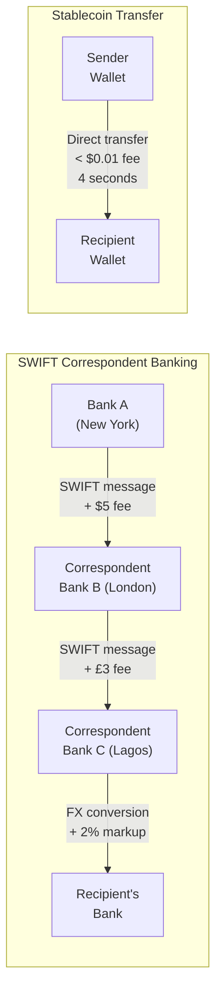
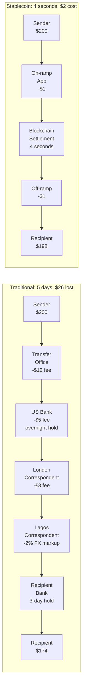

# Slow Money

The human race connected five billion people on social media. Put $6.4 trillion in commerce online — a fifth of all retail on Earth.[^1] Sent work remote overnight — Zoom went from 10 million daily users to 300 million in three months.[^2] Information became free. Entertainment became instant. Communication became invisible.

But money? Money still moves like it's 1973.

At least across borders. And if you're reading this from a country with a stable currency and a bank account that works, you might not feel it. Your card swipes fine. Your Venmo sends. Your direct deposit lands on Friday. Everything seems to work.

It doesn't. It just seems like it does because you've never seen anything better.

## The Fundamental Problem: Money Lives Inside Banks

Every bank maintains its own truth about who has what. Your bank has a ledger. Your employer's bank has a different ledger. Your landlord's bank has another. When money moves between them, it's not actually money moving — it's a reconciliation between institutions. Your bank tells their bank, their bank tells their bank, and somewhere down the chain, a number changes in a database.

This is not a bug. This is the architecture. Money was designed to be institutional. It was designed to live inside banks, behind walls, accessible only with permission — an account, an identity, a physical presence, a credit history.

The result: money can only move as fast as institutions let it, and only to people institutions approve of.

Every problem in this chapter traces back to that single architectural fact.

## You Must Be Known

To have money in the modern financial system, you must be fully identified. Full stop.

Government-issued photo ID. Proof of residential address. Employment verification. Credit history. Tax identification number. In some countries, biometric data. The system doesn't work if it doesn't know who you are.[^3]

This seems reasonable until you consider who it excludes.

Refugees. Undocumented workers. Citizens of failed states whose government-issued IDs aren't recognized abroad. Women in countries where opening a bank account requires a male guardian's permission. Indigenous communities without residential addresses the system recognizes. Anyone who has moved, who has fled, who lacks the documentation trail that institutions demand.

The World Bank estimates 850 million people globally lack any form of official identification.[^4] For them, the financial system doesn't just exclude by policy — it excludes by architecture. There is no spectrum between "fully identified" and "totally excluded." You either have the papers, or you don't exist.

And even in developed countries, the identity requirement creates friction that looks smaller but isn't. A US immigrant whose foreign ID isn't accepted at her local bank branch. A college student whose only address is a dorm room that doesn't satisfy the bank's proof-of-residence requirements. A formerly incarcerated person whose credit history is destroyed, who lands on ChexSystems — a banking industry blacklist that lasts five years and makes opening any account nearly impossible.[^5]

Mika Reyes — the designer we met in the last chapter — described what life looked like before stablecoins for her family's cross-border finances: "My dad and I literally kept a handwritten ledger of IOUs between the US and the Philippines. That's how bad it was. That notebook is why I started Parallax."[^6]

A handwritten ledger. In the 21st century. Because the banking system's identity requirements and cross-border limitations made it easier to track money on paper than through institutions.

Identity as a gatekeeper to money isn't a side effect. It's a design choice. Stablecoins offer a different choice — one where small, everyday transactions don't require identity at all, and larger ones can prove compliance without surrendering all your personal data. That architecture is explored in Chapter 4.

## The Pipes Are Scared

The backbone of international money movement is a system called SWIFT.[^7] It was built in 1973. Fifty-three years ago.

Here's how SWIFT works: it doesn't actually move money. It sends messages. Bank A in New York sends a message to Bank B in London: "Please move $200 from Account X to Account Y." Bank B checks its records, confirms the instruction, and tells Bank C in Lagos, Nigeria to credit the recipient. Each bank in the chain only trusts the next one, so every hop is a settlement checkpoint, a compliance verification, and an opportunity for someone to take a cut.

The result: 2-5 day settlement times. Multiple intermediary banks. Opaque fees — the sender often doesn't know the final cost until the money arrives. If it arrives. Miss the cut-off window on Friday, wait until Monday. And that's for the transactions that go smoothly.

The system is not just old. It's shrinking. Over 20% of correspondent banking[^8] relationships have been cut globally since 2011 — banks dropping connections to other banks because the cost of AML[^9] compliance outweighs the revenue from serving small markets.[^10] Small countries like Tonga and Liberia have had their correspondent banking links severed entirely, cutting them off from the global financial system. Pacific island nations lost all banking connections.

Even SWIFT itself knows the pipes are breaking. They launched SWIFT gpi for faster tracking. They experimented with blockchain interoperability through Chainlink in 2023. The BIS put it plainly in their 2025 Annual Report: "Cross-border payments have not kept up with the progress — they cost more, take longer, and are less transparent."[^11]

The pipes are scared. Deutsche Bank estimates that fintech and crypto solutions could grab $50-100 billion in annual correspondent banking revenues by 2030.[^12] A Latin American bank ran a test: sending $100,000 via stablecoin took 2 minutes and cost $0.20. The same amount via correspondent wire took 2 days and cost $550 in fees and intermediary charges. One transaction, same money, same people. Thousand-to-one cost difference.

And it's not just private companies routing around SWIFT. China's payment system, CIPS,[^13] linked with Russia's SPFS[^14] to bypass SWIFT entirely. China-Russia bilateral trade hit $218 billion in 2024 with a growing share settled in yuan[^15] and rubles,[^16] completely outside the Western financial plumbing.[^17] Governments are routing around the system too.

## The $58 Billion Tax on Poverty

"For over a century, the business model for global remittances[^18] has been simple: charge a staggering fee to the people who can least afford it."[^19]

Global remittances in 2024: $905 billion.[^20] Average fee: 6.4%.[^21] That's $58 billion a year extracted from the working class — from Filipino nurses in Dubai, from Guatemalan construction workers in Houston, from Zimbabwean teachers in London.

These aren't abstract figures. They're families. A Filipino worker in the UAE sends money home and the chain looks like this: exchange house takes a cut, correspondent bank takes a cut, FX[^22] conversion takes a cut, receiving bank takes a cut, family gets what's left 3-5 days later.

Pablo Toro — the delivery driver we met in the last chapter — described what the old system felt like:

"Before, I would send the money and then... nothing. For days. My mother would go to Western Union and sometimes they would say it hadn't arrived. I couldn't sleep those nights."[^23]

The 7% fee wasn't the worst part. The worst part was the silence. Days of not knowing if the money that his mother needed for medicine had made it through six institutions, each one indifferent to her urgency.

Intra-African fees often top 10% — among the highest globally.[^24] A worker in Johannesburg, South Africa sending money to her family in Harare, Zimbabwe can lose a tenth of her paycheck to the transfer. The US-Mexico corridor moves $68 billion annually, with billions lost to fees.[^25] Gulf-to-South Asia corridors drain Filipino, Indian, and Pakistani workers.

Even the incumbents admit the system is broken. Western Union launched a stablecoin — USDPT on Solana — in 2025. Their CEO Devin McGranahan said it would "fundamentally reshape how money moves worldwide."[^26] MoneyGram now offers cash-to-USDC conversion in over 180 countries.[^27] The largest and oldest money-movers in the world have publicly conceded their own rails are broken.

Fortune magazine framed the stakes: "Stablecoins will shake up the $900 billion remittance market — setting up a fight between crypto firms and legacy brands like Western Union."[^28]

## 1.4 Billion People Don't Exist

Financially speaking.

1.4 billion adults globally have no bank account. Millions more are technically "banked" but can't access basic services — dormant accounts, minimum balance requirements they can't meet, branches too far away to reach. The FDIC estimates 4.2% of US households — 5.6 million people — are unbanked even in the world's largest economy.[^29]

The requirements to exist in the modern financial system: a physical branch visit, a government-issued ID, a minimum deposit, a credit history, an employment record, a residential address. If you lack any of these, you don't exist. Not to the bank. Not to the payment system. Not to the global economy.

The exclusion is structural. It's not profitable for banks to serve the last mile. Setting up a branch in rural Bihar, India or a small town in Malawi costs more than the deposits would generate. So they don't. And the people who live there are left with cash — physical, vulnerable, uninvested, earning nothing.

Femi — the Nigerian importer we met in the last chapter — encountered the exclusion from the other side. Not as someone too poor to bank, but as a businessman whose bank couldn't serve his basic needs.

"I spent one month trying. One month. The bank gave me $10,000 of the $100,000 I needed. They told me to source the rest on the black market. So I did — but not the way they expected."[^30]

His bank didn't lack the technical infrastructure to process the transfer. It lacked the foreign exchange allocation. Nigeria's capital controls rationed dollar access, and Femi's business needed dollars that the banking system couldn't provide. The exclusion isn't always about poverty. Sometimes it's about a system so constrained that even its own customers can't use it.

Mobile money was a partial answer. M-Pesa revolutionized Kenya — over 50 million users, financial transactions via mobile phone.[^31] But M-Pesa is still siloed. It requires telco permission. It's national, not global. Try sending money from M-Pesa in Kenya to a bank account in Nigeria. You can't.

## Inflation as Silent Theft

In Buenos Aires, Argentina, an Argentine teacher described converting her pesos[^32] to stablecoins as "stepping from a shaky boat onto solid ground."[^33]

Argentina: over 100% annual inflation. Your savings, halved in a year. Strict capital controls make buying physical US dollars nearly impossible through official channels.

Venezuela: hyperinflation made the bolivar essentially worthless for daily life. Pablo Toro left Caracas, Venezuela because his salary as a security guard couldn't buy groceries. In Bogota, Colombia he sends money home through a crypto app because "bank deposits sharply depreciate in weeks or even days."[^34]

Turkey: the lira[^35] lost over half its value in two years. A college student in Istanbul, Turkey set up a USDT wallet for his grandmother after her pension kept losing purchasing power. After months of stable purchasing power, she became a convert to the "dijital dolar."[^36]

Lebanon: the banking crisis froze withdrawals. Citizens in Beirut couldn't access their own money. Mothers safeguarded medicine money in USDT on Tron.

Nigeria: Temi — who works at one of the country's top banks in Lagos — secretly stashes her personal savings in USDT. "Inflation is eating away the value of the naira, meaning my savings and investments in naira are worthless."[^37] A bank employee doesn't trust her own bank.

In all of these countries, citizens have no opt-out within the traditional system. You are trapped in your currency unless you are rich enough to hold assets abroad. The psychological toll is real — people describe hyperinflation as watching their life's work melt. Converting to stablecoins is described as "therapeutic." "When I put my pesos into USDC, I can finally breathe. I know my money will be the same value next week."[^38]

### The US Is Not Invulnerable

These inflation stories might feel distant. Argentina, Venezuela, Turkey — those are unstable economies with weak institutions. The United States is different.

Except the US has its own inflation history, and it's more aggressive than most Americans realize.

In the 1970s, the US experienced stagflation — simultaneous high inflation and economic stagnation. The Consumer Price Index[^39] peaked at 14.8% in March 1980.[^40] Federal Reserve Chair Paul Volcker raised interest rates above 20% to break the cycle — the harshest monetary medicine in American history, triggering a severe recession to cure the inflation.[^41]

After the 2008 financial crisis, the Federal Reserve expanded its balance sheet from $0.9 trillion to $4.5 trillion through quantitative easing.[^42] The recovery was "K-shaped" — asset prices soared (benefiting the wealthy who held stocks and real estate) while wages stagnated for everyone else.

Then came 2020. The pandemic triggered the largest fiscal and monetary response in US history. The CPI peaked at 9.1% in June 2022 — the highest in 40 years.[^43] The Fed raised rates to 5.25-5.50% to contain it.

The purchasing power numbers tell the story plainly:

- **$1 in 2020 is worth approximately $0.83-84 in late 2024.** A 16-17% loss in four years.[^44]
- **$1 in 1970 is worth approximately $0.13 today.** 87% of its purchasing power — gone.[^45]

During the post-2020 inflation spike, the average FDIC-insured savings account paid approximately 0.06% interest through most of 2021 and early 2022 — rising to only about 0.42% by December 2024.[^46] Against 9% inflation, a savings account was a guaranteed losing position.

Here's what that looks like in dollars. Take $10,000 in savings:[^47]

| Strategy | 4-Year Value (Real) |
|---|---|
| Bank savings at 0.01% APY | ~$8,360 |
| Stablecoin lending at 4% APY | ~$10,166 |
| Stablecoin DeFi at 8% APY | ~$12,277 |

The bank saver lost $1,640 in real purchasing power. The stablecoin saver — earning yields available on platforms like Aave and Compound — preserved or grew real value.

This isn't just a developing-world argument. The American saver with $10,000 in a savings account lost more purchasing power between 2020 and 2024 than many stablecoin users in developing countries. The scale is different. The mechanism is identical.

The UK peaked at 11.1% inflation in October 2022. The Eurozone hit 10.6% the same month.[^48] The "stable" economies weren't stable.

And none of this addresses the structural question: there is no constitutional or statutory right to a bank account in the United States.[^49] Americans ASSUME access to banking. There is no legal guarantee of it. The implications of that gap — and who falls through it — are explored in Chapter 3.

## "But We Have Venmo"

Fair point. Some countries have built genuinely great domestic payment systems.

UPI in India: 12 billion transactions in a single month, zero fee to consumers.[^50] PIX in Brazil: 89% of adults used it, cut merchant costs by 85% versus card payments.[^51] FedNow in the US: near-real-time domestic clearing for about $0.045 per transaction.[^52]

These are real achievements. For domestic payments with good banking access, they work beautifully.

But none of them cross borders. PIX "lacks cross-border functionality" by design.[^53] FedNow stops at the water's edge. UPI requires SWIFT intermediaries to go international. And none of them solve inflation hedging, permissionless access, programmability, or the unbanked problem.

The insight from the research is actually surprising: stablecoins and these domestic systems are more complementary than competitive. The future might look like this: UPI converts rupees[^54] to a stablecoin, the stablecoin crosses the border in seconds, PIX converts it to reais[^55] on the other side. Stablecoins as the glue between domestic systems. Mastercard is already piloting exactly this.[^56]

While crypto aimed to bypass banks, its greatest payment impact might be augmenting existing financial plumbing to be more interoperable.

## The $200 Journey

Here is what happens when a woman in New York sends $200 to her cousin in Lagos, Nigeria today, through the traditional correspondent banking system.

She walks into a money transfer office on a Tuesday afternoon. She fills out a form. She shows her ID. She hands over $200 in cash, plus a $12 fee.

Her $200 enters the system.

**Hop 1:** The transfer company's US bank receives the funds. They hold the money overnight because the cut-off time for outgoing wires was 3pm and it's now 3:47pm. Processing begins Wednesday morning. The bank charges a $5 handling fee internally.

**Hop 2:** The US bank sends a SWIFT message to its correspondent bank in London — because there's no direct relationship between this particular US bank and any Nigerian bank. The London bank receives the message on Wednesday, processes it Thursday morning (there was a queue), and deducts a £3[^57] intermediary fee.

**Hop 3:** The London bank sends a SWIFT message to a correspondent bank in Lagos. This takes another day because of time zone differences and compliance checks. The Lagos correspondent receives the instruction Friday morning.

**Hop 4:** The Lagos correspondent bank converts the remaining USD to naira at its own exchange rate — which is worse than the market rate by about 2%. It sends the converted naira to the recipient's bank.

**Hop 5:** The recipient's bank receives the naira deposit and places a hold — standard procedure for incoming international transfers. The hold lasts until Monday.

**Hop 6:** Monday morning, the funds clear. The cousin receives a notification. She goes to the bank. She waits in line. She withdraws what's left.

Five days. Six institutions. Each one took a cut or added a delay. The original $200, after the initial fee, the intermediary fees, the FX markup, and the holds: **$174.**

$26 gone. And that's a clean transaction — no errors, no rejected wires, no compliance flags that freeze the transfer for an additional week of investigation.

Now here's the same $200, same people, on Stellar.

The woman in New York opens an app. She converts $200 to USDC. The app sends the USDC to her cousin's wallet address in Lagos. The blockchain fee is a fraction of a cent. Settlement time: 4 seconds.

Her cousin receives a notification on her phone. She opens her wallet. She sees $198 in USDC — $2 total for the on-ramp and off-ramp combined. She taps "convert to naira," and the money hits her mobile wallet or bank account within minutes.

Same money. Same people. Same Tuesday.

**$174 in five days versus $198 in four seconds.**

The gap should feel obscene. Because it is.

## The Punchline

The human race built a global real-time network for video streaming, connected five billion people on social media, and put $6.4 trillion in commerce online. Video calls to the other side of the planet are free. A text message arrives in seconds regardless of distance.

And money still moves like it's 1973. Across borders. For the billions who need it most. For Americans losing purchasing power in savings accounts paying 0.01%. For Nigerians whose banks can't give them dollars. For freelancers keeping handwritten ledgers of IOUs because the banking system is too slow, too expensive, and too unreliable.

Individual countries have modernized domestically. But the cross-border system, the permissionless access, the inflation escape hatch — those are still broken. Money is the last major information system that hasn't been put on a shared, open, global ledger.

The gap between the dream in Chapter 1 and the reality in this chapter should feel offensive.

It should.

Because there's a bridge.

---

[^1]: eMarketer / Capital One Shopping, global e-commerce data, 2024.

[^2]: Zoom Blog, user data from December 2019 (10M) to April 2020 (300M).

[^3]: Know Your Customer (KYC) requirements mandate that financial institutions verify the identity of their clients. Anti-Money Laundering (AML) regulations require ongoing monitoring of transactions.

[^4]: World Bank, ID4D Global Dataset, 2021.

[^5]: ChexSystems is a consumer reporting agency that tracks checking and savings account histories. Negative reports remain for five years and can prevent consumers from opening accounts. Office of the Comptroller of the Currency (OCC).

[^6]: "Mika Reyes," character based on documented stablecoin payroll platform founders. Quote from character bible.

[^7]: SWIFT (Society for Worldwide Interbank Financial Telecommunication) is a messaging network that financial institutions use to send and receive information about financial transactions. Founded in 1973, headquartered in Belgium. It connects over 11,500 institutions in 224 countries.

[^8]: Correspondent banking is the arrangement where one bank (the correspondent) provides services — particularly international payments — on behalf of another bank (the respondent). A correspondent bank acts as an intermediary, enabling the respondent bank to access financial services in jurisdictions where it doesn't have a physical presence.

[^9]: AML (Anti-Money Laundering) refers to laws, regulations, and procedures designed to prevent criminals from disguising illegally obtained funds as legitimate income.

[^10]: BIS, "Correspondent Banking Relationships," multiple reports 2015-2025. Over 20% decline in relationships since 2011.

[^11]: BIS Annual Report 2025.

[^12]: Deutsche Bank, digital assets research note, 2024.

[^13]: CIPS (Cross-Border Interbank Payment System) is China's international payment system, launched in 2015 as an alternative to SWIFT for yuan-denominated transactions.

[^14]: SPFS (System for Transfer of Financial Messages) is Russia's alternative to SWIFT, developed after Western sanctions threatened to disconnect Russian banks from SWIFT.

[^15]: The yuan (also called renminbi, RMB) is the national currency of the People's Republic of China.

[^16]: The ruble is the national currency of the Russian Federation.

[^17]: China-Russia bilateral trade data: Chinese General Administration of Customs, 2024.

[^18]: A remittance is a transfer of money by a foreign worker to their home country. Global remittance flows are among the largest financial flows to developing countries, often exceeding foreign aid.

[^19]: Synaptic Finance, "The Remittance Revolution," November 2025.

[^20]: World Bank, "Migration and Development Brief," 2024.

[^21]: World Bank Remittance Prices Worldwide Database, Q1 2025.

[^22]: FX (foreign exchange) refers to the conversion of one currency into another. FX markups are the difference between the market exchange rate and the rate actually offered to the customer — a hidden fee.

[^23]: "Pablo Toro," character based on documented Venezuelan migrant remittance experiences. Al Jazeera / Reuters, 2021.

[^24]: World Bank Remittance Prices Worldwide, Q1 2025.

[^25]: Banco de México / World Bank, 2024.

[^26]: Devin McGranahan, Western Union CEO, October 2025.

[^27]: MoneyGram / Stellar partnership, 2023-2024.

[^28]: Fortune, "Stablecoins Will Shake Up the $900 Billion Remittance Market," September 2025.

[^29]: FDIC, "How America Banks: Household Use of Banking and Financial Services," 2023 survey.

[^30]: "Femi," character based on documented Nigerian importer experiences. Cambridge African Studies Review, 2025.

[^31]: Safaricom, M-Pesa statistics, 2024.

[^32]: The peso is the national currency of Argentina (also the currency name in Mexico, Colombia, Chile, and other Latin American countries — each with different values).

[^33]: Argentine teacher, anonymous interview, Buenos Aires, 2024.

[^34]: Based on documented Venezuelan migrant experiences in Colombia.

[^35]: The lira is the national currency of Turkey.

[^36]: Reported in Turkish fintech adoption interviews, 2023-2024.

[^37]: "Temi," Nigerian bank employee saving in USDT. Rest of World, 2021.

[^38]: Belo app user, Argentina, 2024.

[^39]: The Consumer Price Index (CPI) measures the average change over time in the prices paid by urban consumers for a basket of goods and services. It is the primary measure of inflation in the United States.

[^40]: US Bureau of Labor Statistics, CPI data, March 1980.

[^41]: The Federal Funds Rate peaked at approximately 20% in June 1981 under Fed Chair Paul Volcker.

[^42]: Federal Reserve, balance sheet data 2008-2014.

[^43]: US Bureau of Labor Statistics, CPI data, June 2022.

[^44]: US Bureau of Labor Statistics, CPI inflation calculator. Cumulative inflation 2020-2024.

[^45]: US Bureau of Labor Statistics, CPI inflation calculator. Cumulative inflation 1970-2024.

[^46]: FDIC, national rate on savings deposits, monthly data 2021-2024.

[^47]: Calculated using nominal returns versus CPI-adjusted real purchasing power over the 2020-2024 period.

[^48]: UK Office for National Statistics, CPI October 2022; Eurostat, HICP October 2022.

[^49]: There is no provision in the US Constitution, federal statute, or regulatory framework that guarantees any individual the right to open or maintain a bank account.

[^50]: National Payments Corporation of India (NPCI), UPI transaction data, 2024.

[^51]: Banco Central do Brasil, PIX statistics, 2024.

[^52]: Federal Reserve, FedNow Service, launched July 2023.

[^53]: Banco Central do Brasil, PIX documentation. PIX is designed for domestic Brazilian real-denominated transactions only.

[^54]: The rupee is the national currency of India.

[^55]: The real (plural: reais) is the national currency of Brazil.

[^56]: Mastercard stablecoin settlement pilot, 2024-2025.

[^57]: The pound (£) is the national currency of the United Kingdom.
