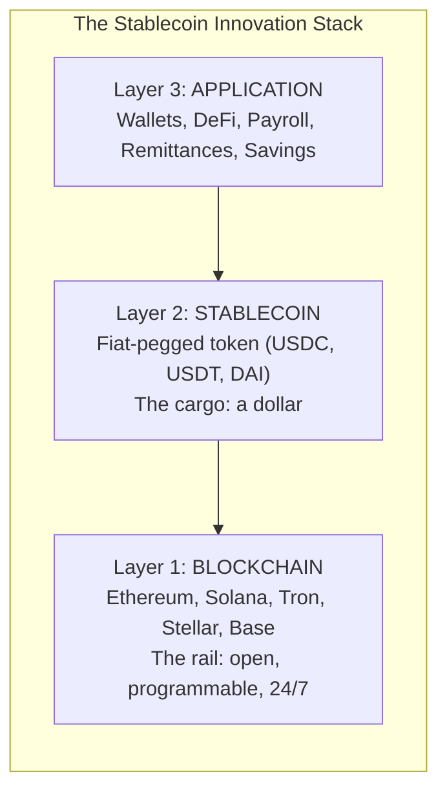

# The Bridge

## The Core Innovation

Before we talk about who's using stablecoins and where, we need to understand what actually changed. Not the token. The ledger.

Here's the innovation stack, in three lines:

Fiat currency was an innovation. Governments said "this paper is worth something" and enough people believed it to make it work.

Blockchain was an innovation. A global, shared, always-on ledger that doesn't need a central authority to validate transactions.

Putting fiat onto a blockchain is a _new_ innovation. Not new money. New rails.

A stablecoin is a dollar that lives on a blockchain instead of in a bank database. Same dollar. Same value. Same purchasing power. But on infrastructure that is open, programmable, global, and instant.

This sounds simple. It is simple. And that simplicity is exactly what makes it powerful.

## The Ledger Is the Innovation

Many economists and technologists argue the true breakthrough lies not in WHAT the value is, but in HOW it moves. The key innovation is the open, distributed ledger.

Think of it this way. A train runs on rails. The cargo matters — you want to ship good cargo. But what determines where it can go, how fast it gets there, and who can access it? The rails.

The dollar is the cargo. The banking system is the old rail network — limited routes, restricted schedules, tollbooths at every junction. Stablecoins put the same cargo on a new rail system — open tracks, running 24/7, with stops everywhere.

MIT's Digital Currency Initiative puts it this way: cryptocurrencies introduced a new ledger technology — global, near-instant, operating without centralized clearing. Stablecoins harness this technology for fiat money.

Circle's CEO Jeremy Allaire says stablecoins "standardize the transport" of dollars without changing the dollars. Andrew Bailey, former Governor of the Bank of England, said digital currencies "will create not just a novel form of money, but also a new payment infrastructure."

## What Changes When Money Lives on a Shared Ledger

Today's financial system is a patchwork of ledgers. Every bank maintains its own database. Central banks have theirs. Payment processors have separate ones. Moving money between them requires reconciliation — multiple institutions verifying with each other that the numbers match, that the money is real, that the sender has permission to send.

If a payment flows via a stablecoin on a blockchain, sender and receiver simply update the same global ledger. No reconciliation between institutions. No intermediary chain. No correspondent bank taking a day and a fee.

Settlement is final and instant. No "pending" status. No five-day hold.

Access is wallet-based, not account-based. Anyone with a phone can participate. No credit check, no minimum balance, no physical branch.

There is no domestic versus international distinction. Money on a shared ledger doesn't know borders. Sending $200 from New York to Lagos, Nigeria costs the same and takes the same time as sending $200 from one wallet to another in the same city.

24/7 operation. No banking hours. No cut-off times. No "your transfer will be processed on the next business day."

The conceptual leap is like the move from fax machines — point-to-point, incompatible across providers — to the internet: one network of networks. Money gets its internet moment.

## The Shipping Container Analogy

In September 2025, the American Institute for Economic Research published a paper with a title that tells you everything: "What Shipping Containers Did for Trade, Stablecoins Can Do for Money."

Before standardized shipping containers, global trade was labor-intensive and slow. Every port had different equipment. Every shipment required manual loading and unloading. Goods sat in warehouses for days or weeks waiting for transfer. Breakage, theft, and delays were constants.

Then someone built a standard box. Same dimensions everywhere. Any ship, any port, any truck, any train. It didn't matter what was inside — silk, electronics, grain — the box fit the same way every time.

Global trade exploded — from roughly $100 billion in 1960 to over $25 trillion today. The container didn't replace ships. It didn't change what people traded. It standardized the transport. And by standardizing transport, it reorganized ports, eliminated entire categories of manual labor, created new logistics industries, and shifted manufacturing to wherever labor was cheapest. The second-order effects dwarfed the first.

Stablecoins are the financial shipping container. The dollar is the cargo. The container standardizes how it moves. And by standardizing digital money transport — same format, any blockchain, any wallet, any country — stablecoins stand to reorganize finance the way containers reorganized trade.

"If we define the standard, the world will adopt it. If we hesitate, others will fill the vacuum."

By defining basic rules and formats — technical standards, reserve requirements, disclosure obligations — analogous to defining container dimensions — governments can make stablecoins safe, interoperable, and scalable. The GENIUS Act and MiCA are doing exactly this.

## 5,500 Years of Ledger Upgrades

The history of money is the history of ledger technology. Every major leap in civilization came with a leap in how humans tracked who owes what to whom. Stablecoins are the latest entry in a lineage that stretches back to the first cities.

**\~3500 BCE — Mesopotamian clay tokens.** Before writing existed, Sumerian merchants sealed small clay tokens inside clay envelopes called bullae. Each token represented a quantity of goods — a sheep, a jar of oil. To audit the transaction, you broke the envelope. Writing itself was born as a bookkeeping technology: the first written records are not poems or prayers but accounting ledgers. The ledger came before the alphabet.

**\~2000 BCE — Babylonian temple banking.** The temples of Babylon functioned as the first banks. Priests kept cuneiform tablets recording deposits, loans, and interest payments. The Code of Hammurabi — one of the oldest legal codes on Earth — dedicates substantial sections to debt obligations, interest caps, and penalties for fraud. The gods were creditors. The temple was the vault. Regulated finance is older than most people imagine.

**\~500 BCE — Greek trapezitai.** Athens had private bankers called trapezitai who sat at tables in the agora, changing currencies, accepting deposits, and issuing credit. The most famous was Pasion — an enslaved man who rose to become one of the wealthiest financial figures in Athens, eventually gaining citizenship through the sheer power of his bank. Banking as a path to power. Sound familiar.

**\~800-1000 CE — Chinese paper money.** The Tang Dynasty invented feiqian — "flying money" — as deposit certificates for long-distance merchants. By the Song Dynasty, these evolved into jiaozi, the world's first government-issued paper currency. The Yuan Dynasty then printed so much money that hyperinflation destroyed the currency's value — the first recorded case of a government debasing paper money. A warning that echoes through every inflation story in this book.

**\~700-1500 CE — Islamic hawala.** The hawala network allowed merchants across the Islamic world to transfer value over vast distances without physically moving money. A merchant in Baghdad gives cash to a hawala broker, who contacts a counterpart in Cairo, who pays the recipient. Settlement between brokers happens later through trust and counter-transactions. The system still processes an estimated $100-300 billion per year globally. Trust-based, decentralized, no central authority. The conceptual ancestor of blockchain, operating a thousand years before Bitcoin.

**1494 — Double-entry bookkeeping.** Luca Pacioli, an Italian friar and mathematician, published the first systematic description of double-entry bookkeeping. Every transaction recorded as both a debit and a credit. For the first time, businesses had a trustworthy record of who owed what to whom. The Medici banking empire in Florence ran on this system — their bills of exchange moved money across Europe without moving gold. Modern finance rests on Pacioli's foundation.

**1609 — The Bank of Amsterdam.** Amsterdam's markets dealt in over 800 different coins — clipped, debased, foreign, counterfeit. Chaos. The Bank of Amsterdam introduced the giro system: merchants deposited physical coins and received ledger credits. Payments happened by updating the bank's ledger — no coins changed hands. Trade flourished because the ledger was trusted more than the coins themselves. It worked beautifully until the bank secretly began lending out deposits beyond its reserves. When the lending was discovered, confidence collapsed. The Bank of Amsterdam is a proto-Tether: reserves backing ledger entries, working perfectly until transparency failed.

**1694 — The Bank of England.** Founded to finance a war, the Bank of England raised £1.2 million in 11 days from 1,268 subscribers. It introduced a revolutionary concept: government debt as the foundation of a banking system. Deposit notes circulated as money. The central bank was born — and with it, the idea that money is a government's promise.

**1871 — The telegraph.** Western Union introduced wire transfers — money as information, transmitted via Morse code. For the first time, value moved at the speed of an electrical signal instead of the speed of a ship. Settlement compressed from weeks to minutes. The conceptual leap is the same one stablecoins complete: money becomes data.

**1913 — The Federal Reserve.** After the Panic of 1907 — when JP Morgan personally bailed out the banking system from his library — the US created a central bank to be the lender of last resort. Fedwire, the Fed's real-time settlement system, became the backbone of domestic dollar movement. Fast, reliable, institutional. Also: completely closed to anyone who isn't a bank.

**1944 — Bretton Woods.** Forty-four nations gathered in New Hampshire and agreed to peg their currencies to the US dollar, which was pegged to gold at $35 per ounce. The dollar became the world's reserve currency. When Nixon ended gold convertibility in 1971, the dollar's dominance continued anyway — through sheer network effects and the absence of a better alternative. Every USD stablecoin inherits this legacy.

**1973 — SWIFT.** The Society for Worldwide Interbank Financial Telecommunication standardized interbank messaging across 224 countries and 11,500+ institutions. SWIFT processes up to 68 million messages on a record day. But SWIFT just sends messages — the actual movement of funds still hops through correspondent banks, each one adding time and cost. Stablecoins cut out those hops entirely.

**2007 — M-Pesa.** Kenya's mobile money system enrolled 40% of the country within two years. "Uko na paybill ama till?" — "Do you have a paybill or till number?" — became the Kenyan equivalent of "do you take Visa?" A _Science_ study found M-Pesa lifted 194,000 households out of extreme poverty. The proof that financial infrastructure leapfrogging works — and that the unbanked adopt fastest when the technology meets their actual needs.

**2009 — Bitcoin.** Satoshi Nakamoto embedded a newspaper headline in Bitcoin's genesis block: "Chancellor on brink of second bailout for banks." For the first time in history, a ledger operated without any institution behind it. The technology was the trust. Bitcoin proved the concept; stablecoins made it useful for daily life by removing the volatility.

**2014 — Stablecoins.** Realcoin launched, later rebranding to Tether. The idea: a blockchain token backed 1:1 by dollars in a bank account. The parallel to the Bank of Amsterdam is exact — ledger entries backed by reserves, credibility dependent on transparency about those reserves. The oldest question in finance — "is the money actually there?" — applies to stablecoins precisely the way it applied to Amsterdam's giro credits four centuries ago.

```mermaid
flowchart LR
    A["~3500 BCE<br/>Clay Tokens"] --> B["~2000 BCE<br/>Temple Banking"]
    B --> C["~500 BCE<br/>Greek Trapezitai"]
    C --> D["~800 CE<br/>Hawala Networks"]
    D --> E["~1000 CE<br/>Paper Money"]
    E --> F["1494<br/>Double-Entry<br/>Bookkeeping"]
    F --> G["1609<br/>Bank of<br/>Amsterdam"]
    G --> H["1694<br/>Bank of<br/>England"]
    H --> I["1871<br/>Telegraph<br/>Wire Transfers"]
    I --> J["1913<br/>Federal Reserve<br/>/ Fedwire"]
    J --> K["1944<br/>Bretton Woods"]
    K --> L["1973<br/>SWIFT"]
    L --> M["2007<br/>M-Pesa"]
    M --> N["2009<br/>Bitcoin"]
    N --> O["2014<br/>Stablecoins"]
```

The pattern across 5,500 years is consistent: a new ledger technology emerges, skeptics resist, early adopters gain advantage, regulation follows, mainstream integration follows that, and eventually the new system becomes the invisible foundation of commerce. Stablecoins are at the "regulation catches up" stage.

## The Velocity Argument

Here's a number that should make you pause.

The Cato Institute analyzed stablecoin velocity — how many times a single stablecoin dollar turns over per year. The average: 109 times. Some stablecoins turned over at 914 times per year.

Compare that to the M2 money supply — the broad measure of dollars in the traditional economy. M2 velocity is in the single digits. One stablecoin dollar does the work of dozens of traditional dollars.

And unlike M2, which is an estimate derived from indirect measurements, stablecoin transactions are recorded on public blockchains. Every transfer, every amount, every timestamp — verifiable by anyone. The velocity measurement is exact, not estimated.

Instant settlement, continuous availability, and programmability generate liquidity without leverage. Small pools of stablecoin capital support enormous transaction volumes. "The technology on its own generates liquidity, without the need for leverage."

The velocity leap is like the jump from mail to email. Money moves nearly at the speed of information.

## The On-Ramp as the New Institution

Money enters the stablecoin world through on-ramps — fiat-to-stablecoin conversion. You hand over dollars, you receive USDC. You hand cash to a MoneyGram agent, you receive USDC in your Stellar wallet.

These on-ramps are becoming the new systemically critical institutions. They are the gates between the old system and the new one. Trust comes from reserves — are the dollars actually there? Transparency — can you verify it? Redemption guarantees — can you get your dollars back?

Circle publishes monthly reserve reports. Tether publishes quarterly attestations. The GENIUS Act mandates regular audits and bankruptcy-remote reserve structures. The on-ramp is where the old world's need for trust meets the new world's tools for verification.

## A Reality Check Before We Continue

The architecture works. People are using it. The history is on its side.

And stablecoins have also produced some of the most spectacular financial failures in recent memory.

In May 2022, TerraUST — an algorithmic stablecoin — entered a death spiral that vaporized $40 billion in days. A young trader in Colombia lost everything: "The guilt is unbearable. This time I'm zero, nothing." Tether, the largest stablecoin, has never completed a full audit by a major accounting firm. Circle's USDC briefly crashed to $0.87 when Silicon Valley Bank collapsed. Regulators across the world are still scrambling to write the rules.

The critics have real arguments. Nouriel Roubini calls stablecoins "the biggest scam of all." Janet Yellen warned they "present the same kind of risks we've known for centuries in connection with bank runs."

This book takes those arguments seriously. Chapter 5 dedicates three full sections to failures, counterarguments, and worst-case scenarios. The architecture described in this chapter is powerful. It is also young, partially unregulated, and carries risks that deserve honest reckoning.

The people in the next chapter — Pablo, Mercy, Femi — are using stablecoins because the architecture works better than what they had. Whether it works well enough, safely enough, and equitably enough is the question the rest of this book engages with.

The foundations are shifting. The next chapter shows you who's already building on them.

***

A ledger is a record of financial transactions. In traditional finance, each bank maintains its own private ledger. A blockchain is a shared, distributed ledger where all participants can verify the same record without relying on a central authority.

This analogy was inspired by Circle CEO Jeremy Allaire's description of stablecoins as "standardizing the transport" of dollars.

MIT Digital Currency Initiative, research papers on distributed ledger technology and stablecoin design.

Jeremy Allaire, Circle CEO, public remarks, 2023-2024.

Andrew Bailey, then-Governor of the Bank of England, speech on digital currencies, 2023.

Scott A. Salter and Tyler Glazier, "What Shipping Containers Did for Trade, Stablecoins Can Do for Money," American Institute for Economic Research (AIER), September 2025.

World Trade Organization and AIER data. Global trade grew from approximately $100 billion in 1960 to over $25 trillion by the 2020s, with container standardization as a major enabling factor.

AIER, September 2025.

The GENIUS Act (Guiding and Establishing National Innovation for US Stablecoins) is the first US federal law regulating payment stablecoins, passed in June 2025. It mandates full reserves in approved assets, monthly attestations, clear redemption rights, and three licensing pathways.

MiCA (Markets in Crypto-Assets) is the European Union's comprehensive regulatory framework for crypto assets, which took effect in mid-2024. It classifies stablecoins as either Electronic Money Tokens (EMTs) or Asset-Referenced Tokens (ARTs).

Denise Schmandt-Besserat, _Before Writing: From Counting to Cuneiform_ (1992). Bullae and clay tokens are among the earliest known accounting artifacts.

The Code of Hammurabi (\~1754 BCE) includes provisions on interest rates, debt forgiveness, and penalties for fraudulent financial claims. Yale Babylonian Collection.

Trapezitai (literally "table men") were private bankers in ancient Greece who operated in public markets, accepting deposits and issuing credit. Edward Cohen, _Athenian Economy and Society: A Banking Perspective_ (1992).

Jiaozi were the world's first government-issued paper currency, introduced during the Song Dynasty (\~1024 CE). The Yuan Dynasty's later overprinting led to one of history's earliest documented episodes of paper money hyperinflation.

Hawala is an informal value transfer system based on the performance and honor of a network of brokers (hawaladars). It predates modern banking by centuries and remains widely used across the Middle East, South Asia, and Africa.

Estimates of annual hawala volume vary widely. The IMF and World Bank have cited figures in the range of $100-300 billion per year.

Luca Pacioli, _Summa de Arithmetica, Geometria, Proportioni et Proportionalita_ (1494). Often called the "Father of Accounting."

A bill of exchange is a written order directing one party to pay a fixed sum to another party at a future date. The Medici bank used these extensively to move value across Europe without physically transporting gold.

A giro system is a transfer system where payments are made by transferring ledger entries between accounts at a bank, without the need to physically move currency. The Bank of Amsterdam's giro system (1609-1820) was among the first major implementations.

Stephen Quinn and William Roberds, "The Bank of Amsterdam through the Lens of Monetary Competition," Federal Reserve Bank of Atlanta, 2014.

Bank of England historical records, 1694.

Western Union began offering telegraph-based money transfers in 1871, establishing the concept of "wiring" money.

The Panic of 1907 was a financial crisis in which JP Morgan personally organized a private bailout of the banking system. The crisis led directly to the creation of the Federal Reserve in 1913.

The Bretton Woods Agreement (1944) established the US dollar as the world's reserve currency, pegged to gold at $35 per ounce. Forty-four allied nations agreed to peg their currencies to the dollar.

On August 15, 1971, President Nixon ended the direct convertibility of the US dollar to gold — the "Nixon Shock" — effectively ending the Bretton Woods system.

SWIFT (Society for Worldwide Interbank Financial Telecommunication), founded in 1973, headquartered in Belgium.

Suri and Jack, _Science_ (2016); Safaricom M-Pesa documentation. M-Pesa enrolled 40% of Kenyan adults within approximately two years of its 2007 launch.

Tavneet Suri and William Jack, "The Long-Run Poverty and Gender Impacts of Mobile Money," _Science_, December 2016.

Bitcoin genesis block (Block 0), mined January 3, 2009. The embedded text references _The Times_ (London) headline from that day.

Realcoin launched in July 2014 and rebranded to Tether in November 2014.

Cato Institute / Caitlin Long analysis of stablecoin velocity, 2024-2025.

M2 money supply is a measure of the total amount of money in circulation, including cash, checking deposits, savings deposits, and other liquid assets. In the US, M2 was approximately $21 trillion as of 2024.

Unlike M2 velocity — which is estimated using GDP divided by M2 and involves significant measurement uncertainty — stablecoin velocity can be directly measured from on-chain transaction data.

Caitlin Long, Cato Institute, on stablecoin velocity and liquidity generation.

The GENIUS Act mandates bankruptcy-remote reserve structures, meaning stablecoin reserves are legally separated from the issuer's other assets and protected from bankruptcy claims.

TerraUST collapse, May 2022. Approximately $18 billion in UST market capitalization and $22 billion in LUNA value were destroyed. Multiple sources including CoinDesk, Bloomberg.

Terra collapse victim in Colombia, quoted in Vice, May 2022.

As of early 2026, Tether has published quarterly attestations (point-in-time snapshots by BDO Italia, formerly Moore Cayman) but has not completed a comprehensive audit by a Big Four accounting firm.

Circle disclosed $3.3 billion in reserves at Silicon Valley Bank on March 10, 2023. USDC briefly traded at $0.87 before recovering after the FDIC backstopped SVB deposits.

Nouriel Roubini, public remarks on stablecoins and crypto, 2022-2023.

Janet Yellen, US Treasury Secretary, Senate testimony, 2022-2023.
