## The Applications

Three people. Three kinds of freedom. Every story in this chapter traces back to the same architectural change from Chapter 3A — one shared ledger instead of fragmented private ones. The data and the dollars are real. So are the people.

***

## Pablo's Money

Pablo Toro used to send money home through a system designed to extract from him. The week-long silences. The 7% fee. His mother at Western Union in Caracas, Venezuela being told the money hadn't arrived. Those nights of not knowing.

The remittance corridor between Colombia and Venezuela is one of the most punishing in Latin America. Pablo's mother needed medicine. The bolivar was collapsing — 1,000%+ annual inflation in some years. Every day the money didn't arrive, the medicine cost more. The fee Western Union charged wasn't just a cost. It was a tax on distance from his family.

So Pablo found a door. He downloaded Valiu — a crypto remittance app — on his cracked phone in Bogota. He converts Colombian pesos to USDT. He sends it to his mother's wallet address, which he knows by heart. She converts what she needs to bolivares for daily expenses and holds the rest in USDT, because the bolivar depreciates in weeks or days.

Ninety seconds. A green checkmark. His phone buzzes. A WhatsApp message from his mother: _Llegó, mijo._

It arrived, son.

"When the power is out in Venezuela, when internet service is down, it has a huge impact on how long it takes to send a remittance. Now I don't have to worry."

Pablo's relief is not abstract. It's the difference between medicine today and medicine next Thursday. Between sleeping through the night and lying awake wondering if the money made it through six institutions, each one taking a cut.

### The Numbers Behind Pablo

Global remittances in 2024 totaled $905 billion. The average fee was 6.4% — roughly $58 billion a year extracted from the working class. For over a century, the business model has been simple: charge a staggering fee to the people who can least afford it.

Pablo's corridor is not unique. Intra-African fees routinely top 10%. A worker in Johannesburg, South Africa sending money to her family in Harare, Zimbabwe can lose a tenth of her paycheck to the transfer. The US-Mexico corridor moves $68 billion annually, with billions lost to fees. Gulf-to-South Asia corridors drain Filipino, Indian, and Pakistani workers in the UAE.

Here's how the costs break down on stablecoin rails. Blockchain fees are trivial — Stellar charges fractions of a cent, Tron charges less than $0.10. The real cost sits on the on-ramps and off-ramps — converting local currency to stablecoins and back — which currently run 0.5-3% per side. Competition is driving these toward 1%. Total: under 2%, versus 6-7% traditional.

Speed: 120-second end-to-end transfers — local currency to stablecoin to local currency — versus 2-5 days through SWIFT.

A Filipino worker in Hong Kong described the shift: "I used to worry for a week if my remittance made it. Now my mother texts me five minutes later — she got it. I cried the first time, out of relief."

The Philippines receives roughly $38 billion a year in remittances. A 3% fee reduction puts over $1 billion back in families' pockets. That's not a rounding error. That's a policy intervention.

### The Incumbents Adapt

MoneyGram now offers cash-to-USDC conversion in 180+ countries through its agent network on Stellar. A user in rural Kenya can hand cash to a MoneyGram agent and receive USDC in their Stellar wallet. Western Union launched its own stablecoin — USDPT — on Solana in 2025. Their CEO called stablecoins "an opportunity, not a threat."

The largest and oldest money-movers in the world have publicly conceded their own rails are broken and are actively building on public blockchains.

One counterintuitive finding: stablecoins aren't always cheaper for well-served corridors. US-India transfers are already below 3% through fintech competition. The transformation is specifically in the high-cost corridors — intra-Africa, Gulf-to-South-Asia, Latin America — where fees routinely hit 7-10% and stablecoins cut them in half or more.

### El Salvador: Where Bitcoin Failed and Stablecoins Quietly Won

In September 2021, El Salvador made Bitcoin legal tender — the first country in history to do so. The government launched the Chivo wallet and gave every citizen $30 in Bitcoin to download it.

60% of Salvadorans tried it. By 2022, usage had cratered. The Bitcoin price swung 30% in a month. Merchants hated the volatility. Street vendors didn't want their day's earnings to lose value overnight.

In January 2025, El Salvador rescinded Bitcoin's legal tender status.

But something unexpected happened alongside the Bitcoin experiment. Stablecoin usage rose to 39% of El Salvador's crypto volume. Tether relocated its headquarters to the country. Salvadoran remittance recipients — people like Pablo, sending and receiving across borders — didn't want a volatile asset. They wanted dollars that moved fast and cheap. Stablecoins delivered exactly that.

The lesson is worth sitting with. The same population that rejected Bitcoin as money embraced dollar stablecoins. The technology wasn't the problem. The volatility was. Stablecoins fixed the one thing that made crypto unusable for daily life — and adoption followed.

26% of US migrants surveyed have used crypto for remittances. In Latin America, crypto-based remittances grew 40%+ year-over-year in 2023.

Pablo doesn't call what he does "using cryptocurrency." He calls it "the app." His mother calls the money "dollars." The technology is disappearing behind the function. That's adoption.

***

## Mercy's Savings

Mercy Musodzi leads a women's savings club in Harare, Zimbabwe. Eleven women sit on plastic chairs in someone's living room once a month. Each contributes her share. The pot goes to one member on a rotating basis — a structure called a stokvel that has been the backbone of community finance in southern Africa for generations.

Last year, they pooled their savings in Zimbabwean dollars. By the time the last woman's turn came around, inflation had eaten 56% of the value. Six months of discipline, halved. Women who had skipped meals to contribute watched their sacrifice evaporate.

Mercy went looking for a solution. She found Celo — a mobile-first blockchain with a dollar-pegged stablecoin called cUSD. She doesn't call it that. She calls it "the digital dollar."

"By converting our pooled funds into stablecoins, we hedge against value loss. The women were nervous at first — they had heard of scams. I showed them, step by step. After six months, they saw the result."

The result: their money held its value. While everyone else's savings halved, the club's pot converted to cUSD on the day contributions came in and cashed out at full value when the beneficiary needed it.

"We're not helpless against inflation now."

### The Trust Formation Cycle

What Mercy did — whether she knows it or not — is a textbook case of how trust forms in communities where institutions have repeatedly failed.

It follows a pattern: peer recommendation first. One person tells another. Then a small test — Mercy converted a small amount, showed the women it worked. Then incremental increase — more money, more months. Then normalized behavior — the club adopted it as standard practice. Then community adoption — other savings clubs in Harare started asking Mercy how she did it.

A new M-Pesa agent in Kenya described the start of this cycle from the other side: "I was so nervous — I thought if I press the wrong button, all my money could vanish."

That nervousness is universal. Every new financial technology starts with someone afraid of pressing the wrong button. What separates adoption from abandonment is whether the first experience works. For Mercy's club, it did. For the M-Pesa agent, it did. The nervous moment passed, and the behavior stuck.

This pattern — trust formed through experience rather than granted through authority — explains why stablecoins are spreading fastest in places where institutional trust is lowest. People in Nigeria, Turkey, and Argentina trust USDT without knowing who runs Tether, because they trust the dollar and they trust the result. The money holds its value. That's enough.

### The Global Inflation Hedge

Mercy's story scales across continents.

In Buenos Aires, Argentina, a stockbroker named Ruben López performs what locals call the "rulo" — buy USD at the official rate, convert to USDT, sell for pesos on the parallel market at a 3-4% profit per round trip. "It's a way to protect myself from inflation. Stablecoins are here to stay; they've given us a refuge from the national currency."

Argentina: over 100% annual inflation. Over 61% of the country's crypto volume is in stablecoins. Stablecoin trading spikes above $10 million per month — ten times the baseline — whenever the peso crashes. USDT is part of the vernacular.

Manuel Beaudroit, CEO of the Argentine fintech Belo: "People can save up for a fridge or a car in stablecoins. It's something previously only those with offshore bank accounts could do." His users scan QR codes, pay merchants in stablecoins, merchants receive pesos — invisible conversion that's now common in Argentine malls.

Nicole Connor, who leads Women in Crypto Argentina: "I keep my savings in crypto and stablecoins and try to generate returns with them." The women in her community aren't chasing crypto hype. They're protecting family security.

In Venezuela, families hold USDT because the bolivar is worthless for daily life — stablecoins have become a necessity. In Turkey, 70% of on-chain volume is stablecoins. In Lebanon, USDT on Tron became the default when banks froze withdrawals during the banking crisis. Mothers safeguarding medicine money in digital dollars. In Afghanistan, 5,000+ women received USDC via mobile wallets when the banking system collapsed — without bank accounts.

In Nigeria, a woman named Temi works at one of the country's top banks. She secretly saves her personal salary in USDT. "Inflation is eating away the value of the naira, meaning my savings and investments in naira are worthless."

A bank employee who doesn't trust her own bank. That sentence tells the whole story of institutional trust collapse in a single image.

Over 30 countries had more than 10% inflation in 2023. In every one of them, stablecoin demand rose. This is digital dollarization from the bottom up — not imposed by governments, chosen by citizens.

### From Feature Phones to Digital Dollars

M-Pesa proved this model works at scale. Launched in Kenya in 2007, it went from zero to over 50% of Kenyan adults in five years. Academic research published in _Science_ in 2016 found that M-Pesa "increased per capita consumption levels and lifted 194,000 households — 2% of Kenyan households — out of extreme poverty." 185,000 women moved from subsistence farming to business occupations.

The parallels to stablecoins are direct: both were driven by distrust of banks and the need for remittances. Same dynamic, same urgency. And now M-Pesa itself is integrating blockchain infrastructure across 8 countries. Kotani Pay and Yellow Card convert between M-Pesa, MTN mobile money, and USDT/USDC across Africa. Mobile money 2.0, global edition.

The leapfrogging concept from development economics applies: instead of building dense branch networks and card infrastructure over decades, developing economies jump straight to mobile wallet plus stablecoin. Cambodia's Bakong — a DLT-based payment system — achieved high adoption without waiting for card penetration. African countries moved from limited telephone access straight to mobile phones, bypassing landlines entirely. The same leap is happening with money.

"Samuel," a 26-year-old Nigerian, needed to pay a $170 Canadian visa application fee. His bank restricted ordinary Nigerians to limited USD amounts per month. "The number one challenge — they are unable to pay. It's not a lot of money, but banks restrict ordinary Nigerians." He bought USDT with naira, found a Canadian peer to swap for CAD, and paid his visa fee. A $170 transaction that his bank wouldn't allow him to make.

Two-thirds of unbanked adults globally already own a mobile phone. The infrastructure to reach them exists. The on-ramp is the phone.

### Brazil: Where Domestic and Global Rails Meet

Brazil's PIX system is a domestic payments success story — 89% of adults use it, and it cut merchant costs by 85% versus card payments. For domestic transfers with good banking access, PIX works beautifully.

But PIX stops at the border.

Brazilian importers and exporters still face the same cross-border friction as everyone else. USDT is available at 24,000 ATMs in Brazil through TecBan and SmartPay. BTG Pactual — one of Brazil's largest banks — launched its own stablecoin. The Digital Real pilot is underway.

A Brazilian central banker acknowledged in 2025: "Perhaps it's better to integrate stablecoins into the system than fight them — they clearly address user needs in FX access and payments."

The future is already visible: PIX for domestic, stablecoins for cross-border. Complementary, not competitive. Mastercard is piloting exactly this integration — domestic systems handing off to stablecoin rails at the border, then handing back to domestic systems on the other side. Stablecoins as the glue between walled gardens.

***

## Femi's Trade

Femi spent a month fighting his bank for $100,000 in foreign exchange to pay a supplier in Shenzhen, China. They gave him $10,000. "Source the rest on the black market," they told him.

He did — but not the way they expected.

Femi opened Binance, navigated to the P2P marketplace, and converted 75 million naira to USDT. He copied his supplier's Tron wallet address from a WeChat message, pasted it, and sent.

Twenty minutes. One dollar in fees.

His supplier in Shenzhen confirmed receipt within the hour. The shipment of phone accessories was on a container ship by Friday. Femi closed his laptop and stepped out of the car into Lagos heat.

He doesn't think of himself as a crypto enthusiast. He thinks of himself as a businessman who found a door that was always locked and then just opened.

### The China-Africa Trade Corridor

Femi's transaction isn't an outlier. It's a pattern spreading across one of the world's most important and least discussed trade corridors.

Chinwendu Aronu, another Nigerian importer, described what the corridor used to look like: "Importers literally traveled with bags of money to China because bank transfers were that unreliable and restricted."

Chinese exporters increasingly accept USDT from African importers who can more easily acquire USDT than dollars through official channels. The China-Africa trade corridor — hundreds of billions of dollars per year — runs substantially on Tether.

Chris Maurice, CEO of Yellow Card — the largest crypto exchange in Africa, operating across 20 countries — put it directly: "Africans are choosing stablecoins out of financial survival, not love of the tech."

That framing matters. This is not adoption driven by ideology or speculation. It's adoption driven by a broken banking system and a need to do business.

### Nigeria: The Full Timeline

Nigeria's stablecoin story is the most complete case study in the world for bottom-up financial transformation.

**2017-2020:** Organic adoption grows as Nigerians discover Bitcoin and stablecoins for remittances and dollar access. Yellow Card and other local exchanges launch.

**February 2021:** The Central Bank of Nigeria bans banks from servicing crypto exchanges. The stated reason: protecting the naira and preventing money laundering.

The ban didn't kill crypto. It drove it underground. Peer-to-peer trading exploded. Chimezie Chuta, founder of the Blockchain Nigeria User Group: "The ban drove crypto underground but didn't stop it. Nigerians are simply too hungry for dollars and yield."

**Late 2021-2022:** The eNaira — Nigeria's central bank digital currency — launches. Adoption stalls at 0.5%, fewer than 1 million active users. The IMF later noted it "has not moved beyond initial wave of limited adoption."

Meanwhile, stablecoin adoption accelerated. By mid-2022, USDT was being used for merchant pricing in Lagos markets. Street vendors quoting prices in both naira and USDT.

**2023-2024:** The naira floated, losing over 40% of its value. Crypto volume in Nigeria hit $60 billion in one year. 25.9 million Nigerians — 11.9% of the population — became digital asset users, overwhelmingly using USD stablecoins for cross-border payments, hedging, and dollar access.

**2025:** The IMF attributed part of Nigeria's currency instability to stablecoin-driven capital flows. The SEC began licensing crypto platforms. The government shifted from prohibition to regulation — because prohibition had failed.

Ham Serunjogi, CEO of Chipper Cash — a Pan-African fintech with over 5 million users, 70%+ aged 18-35 — described the product: "A user in the US can send USDC on Chipper, and their relative in Uganda gets shillings almost instantly."

The #EndSARS protests in 2020 provided another data point. When the Nigerian government froze bank accounts of protest organizers, donations shifted to Bitcoin and stablecoins — money that couldn't be frozen by a domestic institution. Financial censorship resistance wasn't theoretical. It was tested in real time.

The pattern in Nigeria repeats globally: ban, underground adoption, failure of state alternatives, grudging regulation. The genie never goes back in the bottle.

### B2B Payments at Scale

Femi's $100,000 transfer is one transaction. The infrastructure being built handles millions of them.

Visa is piloting USDC settlement with acquirer banks — 24/7 fund movement, cutting out correspondent banks entirely. "We don't see stablecoins as competition to our network — we see them as just another network we will move money over," said Visa's crypto executive.

Stripe offers USDC payouts to 60+ countries and acquired a crypto startup for $1 billion to bolster stablecoin capabilities. JP Morgan has processed $300 billion in JPM Coin transactions for corporate clients — instant blockchain-based settlement on a private Ethereum variant.

Supply chain firms are settling invoices in minutes instead of days. Smart contracts tied to IoT sensors and bills of lading can release USDC payment automatically on delivery confirmation. Programmable money in logistics — a smart container triggers payment when it reaches port.

29% of Fortune 500 executives expressed interest in stablecoins in 2025 — up from 8% the year before. 90% of institutional finance is exploring stablecoin integration, according to Fireblocks. Small and medium business stablecoin usage doubled from 17% to 34% between 2024 and 2025.

### The Gig Economy Gets Paid

Mohamed A., an East African developer working on Upwork, used to endure a five-step payment nightmare: Upwork to PayPal to Wise to Binance to P2P USDT to local cash. Each hop ate fees and added days.

"I used to convert my Upwork earnings through 3 apps just to get USDT. It was slow and full of fees. Now I link my VaultLeap USD account and my payment lands as USDC instantly."

Cross-border payroll platforms like Bitwage, Deel, and Request Finance are built on stablecoin rails. Filipino gig workers receive USDT and cash out through local exchanges. Latin American freelancers invoice global clients in stablecoins to avoid PayPal's high fees and currency conversion markups. Colombian freelancers invoice in DAI.

A gig worker finishes a job at 11pm on a Sunday and has the money on his phone before sleep. Near-instant payouts versus days-long international ACH. The whole concept of "payday" starts to feel arbitrary when settlement is instant.

Kristalina Georgieva, Managing Director of the IMF, acknowledged the shift: "Stablecoins can make payments faster and cheaper, particularly for people in regions where traditional services are costly or slow."

When the IMF validates the use case, the debate about whether stablecoins have real-world utility is over. The debate now is about governance, risk, and who controls the rails.

***

## What Connects These Stories

Pablo sends money. Mercy saves money. Femi moves money for trade. Mohamed gets paid. Ruben hedges against inflation. Samuel pays a visa fee. Temi hides her savings from the bank she works at.

Different people, different countries, different problems. Every one of them solved by the same architectural change: money on a shared ledger instead of fragmented private ones.

```mermaid
flowchart LR
    subgraph Remittances["Remittance Corridors"]
        P1["Colombia 🇨🇴"] -->|"Pablo: USDT"| P2["Venezuela 🇻🇪"]
        P3["US 🇺🇸"] -->|"$68B/year"| P4["Mexico 🇲🇽"]
        P5["Gulf States 🇦🇪"] -->|"Filipino workers"| P6["Philippines 🇵🇭"]
    end

    subgraph Savings["Inflation Hedging"]
        M1["Zimbabwe 🇿🇼"] -->|"Mercy: cUSD on Celo"| M2["Value Preserved"]
        M3["Argentina 🇦🇷"] -->|"Peso → USDT"| M4["Dollar Savings"]
        M5["Turkey 🇹🇷"] -->|"Lira → USDC"| M6["Stable Store"]
    end

    subgraph Trade["Cross-Border Trade"]
        F1["Nigeria 🇳🇬"] -->|"Femi: USDT"| F2["China 🇨🇳"]
        F3["Latin America"] -->|"Freelancers: DAI"| F4["Global Clients"]
    end
```

The evidence is global. The pattern is consistent. And the adoption is accelerating — not because anyone is evangelizing blockchain, but because the alternative is worse.

These stories might feel distant if your bank works and your currency is stable. But the same infrastructure changes something for everyone — including people who think their financial system is fine.

That's next.

***

A remittance corridor is a specific geographic route along which money flows regularly between two countries — for example, the US-Mexico corridor or the Gulf-South Asia corridor. Fees, speed, and competition vary significantly by corridor.

The bolivar is Venezuela's national currency, which has experienced hyperinflation exceeding 1,000% annually in recent years.

USDT (Tether) is the largest stablecoin by market capitalization, pegged 1:1 to the US dollar. It operates on multiple blockchains including Tron and Ethereum.

Al Jazeera / Reuters, 2021. Interview with Venezuelan migrant remittance sender.

World Bank, "Migration and Development Brief," 2024.

World Bank Remittance Prices Worldwide Database, Q1 2025. The 6.4% average masks wide variation: some corridors are below 3%, others exceed 10%.

World Bank, Q1 2025. Sub-Saharan Africa consistently has the highest average remittance costs globally.

Banco de México / World Bank, 2024.

Tron is a blockchain network that processes over 50% of all USDT transactions globally, favored for its low fees (under $0.10 per transfer) and speed.

On-ramps convert local (fiat) currency into stablecoins. Off-ramps convert stablecoins back to local currency. These are the points where the blockchain system meets the traditional banking system.

Based on Stellar, Tron, and Celo network fee data, plus reported on/off-ramp fees from MoneyGram, Yellow Card, and Valiu as of Q4 2024.

Reported in Filipino overseas worker community interviews, 2023-2024.

Bangko Sentral ng Pilipinas, 2024.

MoneyGram / Stellar partnership announcement, 2023-2024.

Devin McGranahan, Western Union CEO, October 2025.

El Salvador's Bitcoin Law (Ley Bitcoin), effective September 7, 2021.

El Salvador repealed Bitcoin's legal tender status in January 2025 as part of an IMF loan agreement.

Chainalysis, "Geography of Cryptocurrency Report," 2024-2025. Stablecoin share of El Salvador crypto volume.

Chainalysis, 2023-2024. Survey of US migrant crypto usage for remittances.

Character based on documented Zimbabwean women's savings club using Celo stablecoins. Celo case study, 2023.

A stokvel (or savings club) is a rotating credit association common in southern and eastern Africa where members contribute regularly and take turns receiving the pooled funds.

Zimbabwe's inflation rate exceeded 56% in the period described. Zimbabwe National Statistics Agency.

Celo is a mobile-first blockchain designed for financial inclusion, with a dollar-pegged stablecoin (cUSD) that can be sent to phone numbers.

Celo case study, 2023.

This trust formation cycle — peer recommendation, small test, incremental increase, normalized behavior, community adoption — is documented across multiple stablecoin adoption studies. See also the Psychology of Trust framework discussion in Chapter 1.

M-Pesa is a mobile money transfer service launched in Kenya in 2007 by Safaricom. It allows users to deposit, withdraw, transfer money, and pay for goods via mobile phone without a bank account. The name comes from "M" for mobile and "pesa," the Swahili word for money.

Reported in M-Pesa agent onboarding documentation and fintech adoption interviews, Kenya, 2023.

Ruben López, quoted in Bloomberg, October 2025.

Chainalysis, "Geography of Cryptocurrency Report," 2024.

The Argentine peso has experienced chronic devaluation, with annual inflation exceeding 100% in 2023-2024. "Parallel market" and "blue dollar" rates reflect the real exchange rate versus the government-controlled official rate.

Manuel Beaudroit, CEO of Belo, quoted in Argentine fintech press, 2024.

Nicole Connor, Women in Crypto Argentina, 2024.

Chainalysis, 2024. Turkey's stablecoin dominance of on-chain volume.

UNICEF and humanitarian aid organizations distributed USDC and BUSD to Afghan women via mobile wallets after the Taliban's return to power restricted women's access to banking. Binance Charity, 2021-2022.

The naira is Nigeria's national currency. It lost over 40% of its value after the Central Bank of Nigeria allowed it to float in 2023.

"Temi," quoted in Rest of World, 2021.

IMF World Economic Outlook, 2023-2024.

Tavneet Suri and William Jack, "The Long-Run Poverty and Gender Impacts of Mobile Money," _Science_, December 2016.

M-Pesa / Safaricom blockchain integration announcements, 2023-2025.

Bakong is Cambodia's DLT-based payment system, launched by the National Bank of Cambodia, which achieved significant adoption without requiring card infrastructure.

"Samuel," quoted in Rest of World, 2021.

World Bank Global Findex Database, 2021.

Banco Central do Brasil, PIX statistics, 2024.

TecBan / SmartPay partnership, 2024.

Brazilian central banker, quoted at a regional fintech conference, 2025.

Mastercard stablecoin settlement pilot, 2024-2025.

Based on documented experiences of Nigerian importers facing FX restrictions. Cambridge African Studies Review, 2025.

"Femi," quoted in Cambridge African Studies Review, 2025.

P2P (peer-to-peer) trading is a method where buyers and sellers trade directly with each other, without an exchange acting as intermediary. On platforms like Binance P2P, users post buy/sell offers and settle trades via local payment methods.

Chinwendu Aronu, Nigerian importer, quoted in Nigerian trade documentation, 2024.

Yellow Card Africa Report, 2025. Yellow Card CEO Chris Maurice has described USDT as the dominant instrument for China-Africa trade settlement among SMEs.

Chris Maurice, CEO of Yellow Card, quoted in Bloomberg, 2024.

Timeline compiled from: Central Bank of Nigeria directives, IMF country reports, Chainalysis data, Yellow Card Africa Report 2025, Rest of World reporting, and SEC Nigeria licensing records.

Chimezie Chuta, founder of Blockchain Nigeria User Group, quoted in multiple Nigerian tech publications, 2022-2023.

IMF Nigeria Article IV Consultation, 2023. eNaira adoption and usage data.

Chainalysis, "Geography of Cryptocurrency Report," 2024.

Yellow Card Africa Report 2025.

Chipper Cash user demographics, company reports, 2023-2024.

Ham Serunjogi, CEO of Chipper Cash, quoted in fintech industry panels, 2023-2024.

Documented during #EndSARS protests, October 2020. The Feminist Coalition raised Bitcoin donations after bank accounts were frozen. Multiple news sources.

Visa crypto executive, quoted in Visa institutional communications, 2025.

Stripe acquired Bridge, a crypto infrastructure startup, for approximately $1 billion in 2024.

JP Morgan, Onyx by J.P. Morgan (JPM Coin) documentation, 2024-2025.

Fireblocks institutional survey, 2025.

Industry survey data comparing 2024 and 2025 SMB stablecoin usage rates.

Mohamed A., East African developer, quoted in freelancer platform case studies, 2024.

DAI is a decentralized stablecoin created by MakerDAO, pegged to the US dollar through crypto-collateralization rather than fiat reserves in a bank.

Kristalina Georgieva, IMF Managing Director, public remarks on stablecoins and payments, 2024.
