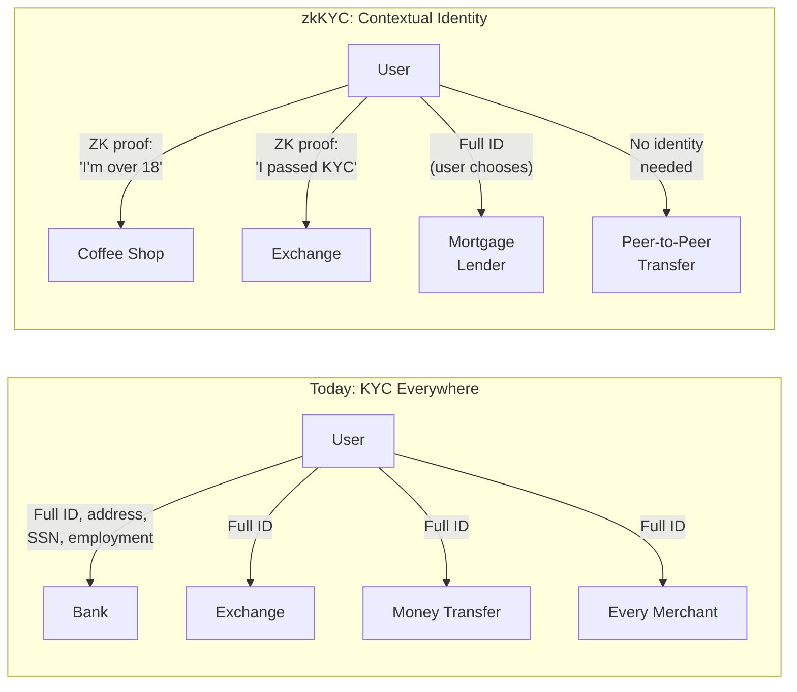

# Fast Money

## The Grand Bazaar

Istanbul's Grand Bazaar has been trading since 1461. Five hundred and sixty-five years of commerce under vaulted ceilings and hand-painted tiles. Merchants here have survived the fall of the Ottoman Empire, two world wars, a dozen coups, and the transition from gold coins to paper lira.

Now they're surviving the lira[^1] itself — using stablecoins to escape the currency's collapse the way their ancestors escaped empires: by finding a store of value that outlasts the institution issuing it.

Between April 2023 and March 2024, Turkish citizens traded $38 billion in stablecoins. That's 4.3% of the country's GDP — the highest proportion in the world. Stablecoins make up 70% of Turkey's on-chain volume. 27% of Turks own crypto, the highest rate globally.

Walk through the bazaar today and you can feel it. The smell of saffron and cumin mixing with the electronic ping of Tron transactions on smartphones. Carpet dealers with phones in both hands — one showing a customer a pattern, the other checking the USDT rate. The lira prices on the hand-lettered signs change more often now. Sometimes twice a day.

A carpet dealer — third generation, his grandfather opened this stall — explains it simply. "My grandfather priced in gold. My father priced in lira. I price in Tether."

Three generations of money in one sentence. The old and the new, overlapping in a space that has been commercial ground since before Columbus reached the Americas.

The lira lost over half its value in two years. Inflation hit 85% in October 2022. The shopkeeper watches it happen in real time — not on a Bloomberg terminal, but in the changing cost of his inventory. The silk he buys from Iran costs more lira every week. The tourists from Germany want to pay in euros. His employees want wages that keep pace with what bread costs.

So he converts. Every evening, whatever he can move out of lira, he moves into USDT. On his phone. From his shop. It takes less time than closing the shutters.

He doesn't think of this as cryptocurrency. He doesn't think of this as a technological revolution. He thinks of this as not being a fool. The lira is a melting ice cube. USDT is a glass you can put it in.

Around the bazaar, the pattern repeats. Crypto billboards on the streets outside. BTCTurk with 5 million users. Exchange kiosks offering lira-USDT pairs alongside the traditional dollar-lira boards that have existed for decades. Turkey's government hasn't banned it — after the Thodex fraud in 2021, they banned crypto as a payment method, but not trading. A digital lira CBDC is in testing. A comprehensive crypto law is expected.

But the law is trailing the behavior by years. The Turkish people didn't wait for regulatory clarity to protect their savings. They just did it.

This is what stablecoins look like when they stop being a fintech product and become a survival mechanism. Not in a lab. Not in a white paper. In a bazaar that has been trading for half a millennium.

---

Everything you read in the last chapter — the broken pipes, the $58 billion remittance tax, the 1.4 billion unbanked, the inflation that eats savings — those were the problems.

Chapter 3 showed you the bridge: how stablecoins work and who's already using them.

What happens when that bridge becomes a highway?

The shift from "better payment rail" to "new financial architecture, geopolitical weapon, and decade-long transformation" is already underway. The speed, the scale, and the power of the new system. Who's building it and why. What happens to the dollar, to China, to Europe, to the countries caught in between. And what the next ten years actually look like — not the dream, not the disaster, but the messy, contradictory, half-built middle.

## The Architecture: What Changes Beyond Payments

### Banks Are Unbundled, Not Eliminated

In a stablecoin world, banks don't own your money anymore. Your money lives on a shared ledger, in your wallet. You hold it. You control it.

Banks still exist. But what they do changes. They provide custody — if you want it. They provide yield — if you opt into lending your stablecoins. They provide lending, compliance, risk management. The difference is that all of these become explicit, opt-in services. You choose to put your stablecoins in a bank or a DeFi protocol to earn 4-8% yield. You know you're taking risk. You're making a decision.

Today, you "deposit" money in a bank and don't think about it. Your money sits on the bank's ledger, and they lend it out at 5% while paying you 0.01%. The deposit is automatic, the risk is hidden, and the value extraction is invisible.

In the new architecture, deposits become explicit opt-in risk decisions, not default behavior. This is a profound shift: from money-inside-banks-by-default to money-in-your-wallet-by-default.

### Identity Becomes Optional, Not Mandatory

Today, to have money in the modern system, you must be known. Full stop. ID, address, credit history, employment verification. If you can't prove who you are, you don't exist financially.

Stablecoins introduce a spectrum. Money behaves like cash. Small everyday payments are anonymous — no identity required. But identity can reattach contextually: buying a house, you prove who you are. Buying a coffee, you don't. You choose when to reveal who you are.

Zero-knowledge proofs make this real — not theoretical, but actually being built right now. Prove you're over 18 without revealing your birthday. Prove you're a resident of France without revealing your address. Prove you passed a KYC check without revealing your name to every merchant you interact with.

The IMF itself has proposed "zkKYC" — identity verification where both parties have their identities confirmed by a licensed credential issuer, but the actual identity data stays off-chain in the user's wallet. The blockchain only sees a cryptographic proof that compliance was met. No personal information is exposed unless a regulatory flag triggers a legal process.

This isn't a crypto fantasy. HSBC and Sony Bank piloted zkKYC in 2024. Circle and Paxos launched USDCx — wrapped USDC with "banking-level privacy" and ZK proofs. Tria integrated zkKYC into stablecoin wallets in late 2025. MAS in Singapore tested DeFi with verifiable credentials.

"Regulators want proof, users want privacy — zkKYC delivers both."[^3]

The Financial Transparency Coalition framed the principle: "Privacy is a human right, and it's reasonable to include financial activities under that umbrella."[^4] And the American Banker's warning adds urgency: "Stablecoins need privacy baked in, not bolted on" — cautioning against building financial surveillance into the system by default.[^5]

The paradigm flip: if these frameworks work, using a stablecoin could offer more privacy than a bank transfer, yet simultaneously more assurance to regulators via math-based compliance proofs. A reconciliation of goals that historically seemed at odds.

Identity moves from being embedded in institutions to being controlled by users. This is the most philosophically radical shift in the entire stablecoin story. Money stops being a surveillance tool by default.

### Trust Shifts From Institutions to Mechanisms

"I trust my bank" becomes "I trust this mechanism."

New trust layers emerge to replace the old ones. Chainlink Proof of Reserve provides on-chain verification that an issuer's collateral actually exists. CertiK and Slowmist audit smart contracts. Grant Thornton and Moore Cayman do reserve attestations. Nexus Mutual offers decentralized insurance covering smart contract failures and depeg events.

S&P has explored rating stablecoins on the quality of their reserves. Depeg insurance exists. Custody insurance exists. The building blocks of a trust infrastructure are being assembled — not by governments, but by the market.

And underneath all of this, invisible to users but essential: the authorized participant and redeemer mechanism.[^2]

So how does USDT actually stay at $1.00? It's not automatic. Large market makers — firms like Cumberland, Jump Trading, and Galaxy Digital — have direct agreements with stablecoin issuers to mint and redeem tokens at par. When USDT trades at $0.998 on an exchange, an authorized participant can buy that discounted USDT, send it to Tether, and redeem it for exactly $1.00 — pocketing a $0.002 profit per token. When USDT trades at $1.002, the participant does the reverse: sends dollars to Tether, mints new USDT at par, and sells it on the exchange at a slight premium.

This arbitrage happens continuously, 24/7, across dozens of exchanges. The profit motive keeps the peg tight — typically within $0.001 of $1.00. The mechanism is similar to how ETF market makers keep exchange-traded fund prices in line with their underlying assets.

The system works well under normal conditions. The vulnerability is during crises. In May 2022, when Terra collapsed, authorized participants hesitated to buy discounted USDT because the news was structural — they weren't sure the underlying reserves justified par redemption. If the news is bad enough, the very participants who maintain the peg can become the ones who break it by refusing to arbitrage. Understanding this mechanism is essential before the Tether failure scenario in Chapter 5.

Trust is now auditable, verifiable, on-chain. Not a promise. A mechanism.

### Investing Becomes Stablecoin-Native

If all money is stablecoins, how do stocks, bonds, treasuries, and retirement work?

Stablecoin becomes the base asset. Everything is priced in it, settled in it. Traditional instruments are tokenized — Franklin Templeton already offers tokenized money market funds on-chain. New DeFi-native instruments emerge: stablecoin lending markets, yield aggregators, derivatives, forex protocols. Inflation-indexed stablecoins pegged to CPI. Commodity-backed stablecoins representing gold or oil.

Total DeFi value locked hit $230 billion in Q3 2025 — a record. 50-60% of all value locked is in stablecoins or stablecoin-derived assets. MakerDAO holds $8 billion in deposits creating DAI, with over $1 billion invested in US Treasuries through real-world asset vaults. Aave V3 holds $15 billion in liquidity. DeFi lending hit an all-time high of $73.6 billion outstanding.

For comparison: US money market funds hold $5.5 trillion. DeFi is about 1% of that. Small — but growing faster than anything else in finance.

### Governments Adapt, They Don't Disappear

Governments can still disburse aid, collect taxes, settle obligations. The Marshall Islands runs a crypto-based UBI program. Palau is piloting a USD-backed stablecoin. El Salvador's Chivo wallet uses stablecoins for dollar transactions.

But governments no longer control the payment rails and no longer gate access to money itself. Monetary sovereignty becomes less about control, more about coordination.

Some governments are leaning in. Some are building alongside — CBDC development coexisting with private stablecoins in the UK, Singapore, UAE. Some are resisting — China bans crypto but pushes its e-CNY digital currency, while Chinese citizens use USDT underground anyway.

The tension is real. It isn't resolved. It might never be.

## The Frontier: Gaming, AI, and the Micropayment Revolution

This is where the book becomes about 2035, not 2025.

### Gaming Economies Become Real Economies

The virtual goods market hit $81 billion in 2023, projected to reach $300 billion by 2031. Global gaming revenue: $184 billion. Almost all of that spending is one-way — money goes in through skins, loot boxes, and in-game currency, but it can't come back out. Stablecoins create a two-way street.

Sony is planning a USD stablecoin for its PlayStation ecosystem. Its banking division is seeking a US banking charter. The goal: bypass credit card processing fees of roughly 3%, create direct wallet-to-store payments for games, in-game items, and anime content. Stablecoins entering mainstream gaming through the storefront first, not the gameplay.

Roblox developers cashed out $525 million in 2021 via Robux conversions. But Roblox controls the exchange rates and sets high thresholds. A stablecoin system would be more open and direct. Second Life's economy reached $567 million in transactions in 2009, with residents cashing out $55 million a year.

The trajectory: stablecoins enter gaming through payment infrastructure first, then marketplace settlement, then potentially gameplay integration. Within a decade, the line between "in-game money" and "real money" may be invisible to a generation that grew up with both.

### AI Agents Paying Each Other

Jeremy Allaire stood at the World Economic Forum in 2025 and said that "billions of AI agents" will join the economy and "need a payment system — there is no alternative other than digital currency and stablecoins."

Why stablecoins? Because an AI agent doesn't have a bank account. It doesn't have business hours. It doesn't wait three days for an ACH transfer. AI agents need money that is always on, granular to sub-cent amounts, programmable through smart contracts, and globally interoperable with no FX conversion or banking intermediaries.

Google unveiled its Agentic Payment Protocol — AP2 — an open standard for AI-to-AI payments with stablecoin support. Over 60 organizations backed it, including banks, processors, and tech firms. Coinbase built x402, activating the HTTP 402 "Payment Required" status code — a code that has been reserved since the web's creation — with Ethereum smart contracts enabling stablecoin payments directly in the browser.

a16z projects that by 2030, autonomous AI agents could conduct $30 trillion in transactions annually. Imagine an AI assistant managing a small business in London: it holds $100 in USDC, negotiates cloud computing rates hourly, streams micropayments per minute of compute used, buys datasets from other AIs. Hundreds of tiny payments per day. Impossible with credit cards.

### The Micropayment Revolution

Credit cards have a floor. $0.30 plus 2.9% per transaction. Anything under about $5 is uneconomic. This fee floor has killed entire categories of commerce.

Stablecoins on layer-2 networks can process transactions of $0.001 with fees of $0.0001. Transactions 100 times smaller than credit cards can handle.

What does this unlock? Pay-per-article journalism — $0.05 per article instead of a $10 monthly subscription for a publication you read twice. Creator tipping that actually works — a YouTuber gets $0.99 of a $1 tip instead of $0.70 after YouTube's 30% cut. Pay-per-use software. Micro-subscriptions. Cloud storage charging fractions of a cent per megabyte per hour.

HTTP 402 — "Payment Required" — has been a reserved status code since the web was created. For thirty years, browsers have had a placeholder for native payments that was never activated. The x402 protocol with stablecoins finally delivers on that three-decade-old promise.

I know this because I built a platform for sportfishing competitions. Sub-dollar entry derbies. The prize pool needs to be 100% whole — you can't skim processing fees off a $2 entry when the total pot needs to be paid out in full. Credit card fees made it impossible. Stablecoins made it possible. What's true for fishing derbies is true for every micro-transaction business that processing fees have killed.

Blink Charging launched a pilot in January 2026 accepting USDC payments at EV charging stations. Car pays charger directly. No app, no card swipe, no intermediary.

The world where your devices transact autonomously — your car paying for charging, your smart home negotiating energy rates, delivery drones paying intersection tolls — isn't science fiction. It's infrastructure being built right now. And it runs on stablecoins because nothing else can handle sub-cent, always-on, permissionless, global micropayments.

---

[^1]: The lira is the national currency of Turkey. It lost over 50% of its value against the US dollar between 2021 and 2023, with inflation peaking at 85% in October 2022.

[^2]: An authorized participant (AP) is a large financial institution with a direct agreement with a stablecoin issuer to mint (create) and redeem (destroy) tokens at par value ($1.00). This mechanism is similar to the creation/redemption process used by ETF market makers.

[^3]: Tria CEO, on zero-knowledge KYC integration, 2025.

[^4]: Financial Transparency Coalition, statement on financial privacy as a human right.

[^5]: J.P. Carpenter, "Stablecoins Need Privacy Baked In, Not Bolted On," American Banker, 2023.
