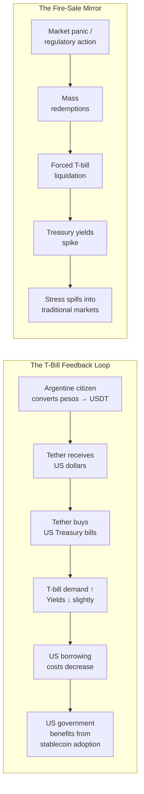
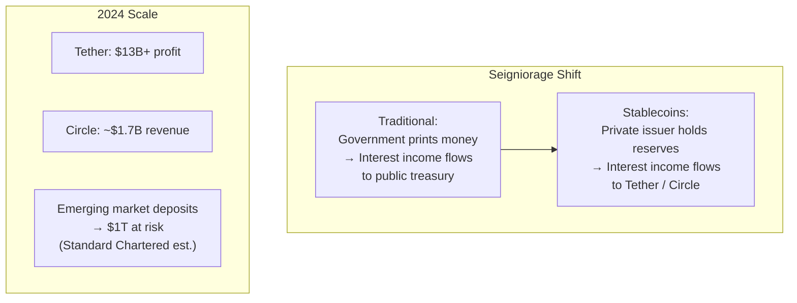
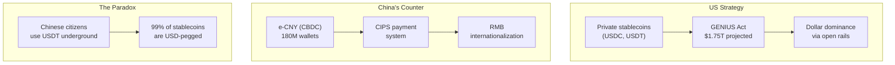
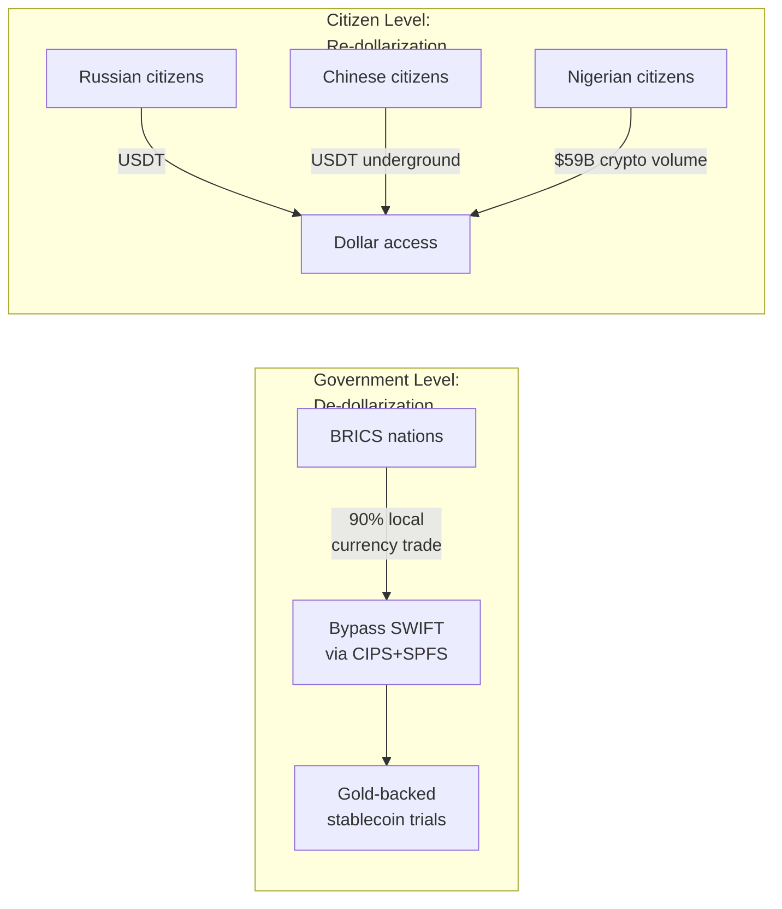

## The Dollar Question

If 99% of stablecoins are USD-pegged, the stablecoin revolution IS dollar proliferation. This is a world power story.

### The Eurodollar Parallel

In the 1960s, US dollars started accumulating in European banks outside American regulation. These "Eurodollars"[^1] were initially viewed with suspicion — unregulated dollars floating around offshore, beyond the Fed's control. But they became integral to global finance. The US eventually supported them because they entrenched dollar dominance without requiring American institutions to be present in every market.

Stablecoins are Eurodollars on blockchain.

Every compliant stablecoin must be backed by reserves held in dollars. As stablecoins are adopted globally, they become a continuous engine of demand for dollar-based assets. Every Nigerian converting naira to USDT is, through a chain of transactions, financing US Treasury bills. Wharton researchers in 2025 called this "crypto's Bretton Woods[^2] for the dollar."[^3]

The difference: Eurodollars were institutional — accessible only to banks and large corporations. Stablecoins started retail, accessible to anyone with a phone. The same dynamic of offshore dollar proliferation, but democratized.

### The T-Bill Symbiosis

The financial relationship between stablecoins and US government debt is the most underappreciated dynamic in the entire stablecoin story.

Tether's Q4 2025 financial report shows the scale.[^4] Total assets: $192.9 billion. Of that:

- **US Treasury bills: $122.3 billion**
- Overnight repo: $19.3 billion
- Term repo: $5.5 billion
- **Total Treasury exposure: ~$147 billion**
- Gold: $17.45 billion (~148 tonnes — placing Tether among the top ~30 gold holders globally)
- Bitcoin: $8.43 billion
- Secured loans: $17.04 billion (borrowers undisclosed)

The Atlantic Council estimated that stablecoin issuers were "the third-largest purchasers of US T-bills in 2024" — approximately $40 billion in new purchases that year, after JPMorgan and China.[^5] That's the flow. The stock — total T-bill holdings across all stablecoin issuers — hit $153 billion by December 2025, according to the BIS, out of approximately $270 billion in total stablecoin assets under management.[^6]

Here's where it gets structurally interesting. The BIS published a working paper calculating that $3.5 billion in stablecoin inflows lowers 3-month T-bill yields by 2-2.5 basis points[^7] — and by 5-8 basis points during periods of Treasury scarcity.[^8]

This creates a feedback loop. As stablecoin adoption grows, more dollars flow into T-bill reserves, which pushes T-bill yields slightly lower, which lowers borrowing costs for the US government. The US government benefits from stablecoin adoption. An Argentine converting pesos to USDT is — through the chain of Tether buying a T-bill with her deposited dollars — essentially lending to the US government.[^9]

The BIS concluded that stablecoins have "blurred the lines between crypto asset markets and safe-asset markets."[^10]

The symbiosis also carries risk. It's symmetric. If stablecoin redemptions spike — say, during a market panic or regulatory crisis — issuers must sell T-bills to honor withdrawals. Emergency selling of $50-100 billion in Treasury bills could widen yields, create price disruption, and spill stress into traditional money markets. The fire-sale risk is the mirror image of the inflow benefit.

And there's the seigniorage question. Tether earned over $13 billion in profit from its reserves in 2024.[^11] That interest income — earned on dollars backing stablecoins held by Nigerian and Turkish and Argentine citizens — flows to a private company incorporated in the British Virgin Islands. It used to flow to governments. Armstrong and Snower wrote in Project Syndicate: "The interest earned on Treasury assets backing stablecoins now flows to private issuers — such as Circle and Tether — instead of to the public purse."[^12] Standard Chartered estimates stablecoins could draw "$1 trillion in deposits from banks in emerging markets over the next three years."[^13]

For small economies, this isn't an academic concern. It's an existential fiscal question.

### The US-China Digital Currency Arms Race

The United States is backing private stablecoins to extend dollar dominance. China is countering with its central bank digital currency, the e-CNY, which has processed over 7.3 trillion yuan — roughly $1.0 trillion — by mid-2025, with approximately 180 million wallet accounts.[^14]

The GENIUS Act projects $1.75 trillion in new stablecoin issuance over three years.[^15] Trump vowed in 2025 to make America "the crypto capital of the world." David Sacks, appointed as "crypto czar," said stablecoins let the US "maintain financial influence without overextension."[^16]

Chinese officials view USD stablecoins as a strategic threat. These tokens bypass capital controls and leak funds out of China's closed financial system. Wang Yongli, former Vice President of the Bank of China: "If China fails to keep up with dollar stablecoins in terms of payment efficiency, progress toward the international use of the renminbi could be limited."[^17]

The Council on Foreign Relations put it bluntly in August 2025: "Bank-issued dollar stablecoins present a powerful use case — a new channel for transacting in dollars that the Chinese state cannot fully monitor, throttle, or shut down."[^18]

Meanwhile, 99% of global stablecoin value is USD-pegged, circulating worldwide via crypto networks beyond any single government's full control. China Daily — state media — acknowledged that stablecoins "are expected to increase demand for US Treasuries, lower interest rates, and secure the dollar's status as the world's reserve currency."[^19]

The irony: China bans crypto domestically but Chinese citizens are among the heaviest USDT users in the world, using it for capital flight despite official prohibition.

The CFR's assessment of the strategic implications: "For Beijing, dollar stablecoins offer an immediate setback. It diminishes progress toward building RMB-based infrastructure. Beijing risks losing not just monetary ground, but also political leverage."[^20]

### BRICS and Alternative Settlement

The BRICS bloc — Brazil, Russia, India, China, South Africa and their expanding membership — is actively pursuing non-dollar trade settlement. By late 2024, 90% of Russia's trade with BRICS nations was conducted in local currencies, according to Putin at a BRICS summit.[^21]

China-Russia bilateral trade hit $218 billion, with a growing share settled in yuan and rubles.[^22] China's CIPS payment system linked with Russia's SPFS to bypass SWIFT entirely. Russia and Iran explored a gold-backed "Persian region" stablecoin for sanctions-proof trade.

In October 2025, the EU sanctioned a Russian state-backed stablecoin called A7A5 — the first stablecoin sanctioned for geopolitical reasons. The EU Council stated: "Recent activity has evidenced Russia's increasing use of crypto. The stablecoin A7A5, created with Russian state support, has emerged as a prominent tool for financing Russia's war in Ukraine."[^23]

But here's the paradox: USD stablecoins like USDT are widely used by private citizens WITHIN BRICS member states. Governments pursue public de-dollarization while their citizens pursue private re-dollarization. The governments try to leave the dollar. Their people run toward it digitally.

A BRICS common currency remains aspirational at best — stalled amid diverging economic conditions and mutual distrust. The yuan accounts for only about 2.3% of global reserves.[^24]

### Dollar Weaponization vs Stablecoin Neutrality

The freezing of over $300 billion in Russian central bank reserves in 2022 was a turning point.[^25] Many nations now view the dollar less as a neutral medium of exchange and more as a tool of geopolitical coercion.

The Institute of Geoeconomics wrote in May 2025: "Several countries have taken steps to hedge against dollar exposure. The dollar appears less like a neutral medium of exchange and more like a tool of geopolitical coercion."[^26]

Stablecoins offer a strange middle ground: the "neutral dollar." Andrew Capistrano, an economic researcher, described it: "Stablecoins offer a way for the dollar to evolve while retaining its global footprint — allowing the US to export dollar liquidity without the burden of political entanglement. In repressed environments, stablecoins can reintroduce a neutral dollar into local markets."[^27]

Some call this "America's Trojan horse" — presented as neutral technology, but cementing the US unit of account even in adversaries' economies.

But stablecoins aren't fully beyond US reach. Roughly 75% of stablecoin reserve assets are held in US Treasuries. Issuers like Circle and Tether have complied with sanctions, freezing blacklisted addresses. Under the GENIUS Act, the US could weaponize stablecoins too. The "neutrality" is conditional.

The Atlantic Council's assessment: "Stablecoins may actually prolong the dollar's dominance by bridging it into the internet age."[^28]

### The European Counter-Move

The EU's MiCA regulation caps non-euro stablecoins at 200 million euros per day or 1 million transactions per day.[^29] Exceed these thresholds and regulatory intervention triggers. Euro-denominated stablecoins face no such cap. The message is clear: this is a sovereignty play.

Christine Lagarde, ECB President, warned that stablecoins could "lead to the privatization of money" and "pose risks for monetary policy and financial stability because they could lure deposits away from banks." She's pushing the digital euro as "key to Europe's financial autonomy."[^30]

Circle's euro stablecoin EUROC is gaining traction under the supportive regime. Some EU exchanges delisted Tether until compliance was assured.

Europe's position: if you can't beat them, regulate them — and build your own.

### The Emerging Market Sovereignty Crisis

The IMF reported in 2025 that "the lion's share of cross-border stablecoin transactions now flow from advanced economies into emerging nations."[^31] Dollar stablecoin use has surged in the exact countries that can least afford to lose monetary sovereignty.

Turkey: $38 billion in stablecoin purchases = 4.3% of GDP.[^32] Nigeria: $60 billion in crypto volume in one year.[^33] Argentina: stablecoin trading spikes above $10 million per month whenever the peso crashes.[^34]

The pattern has historical precedent. Ecuador officially dollarized in 2000 after a banking crisis wiped out savings — the government abandoned the sucre and adopted the US dollar as legal tender.[^35] Zimbabwe dollarized in 2009 after hyperinflation reached an estimated 79.6 billion percent.[^36] El Salvador adopted the US dollar in 2001. In each case, dollarization stabilized daily life but eliminated the government's ability to conduct independent monetary policy.

Stablecoin dollarization follows the same pattern but without the government's consent. It's bottom-up, voluntary, and much harder to reverse. Countries are shifting from prohibition to participation — Nigeria formed a task force, India eased its ban rhetoric, Brazil is regulating — because the genie can't be put back.[^37]

### Is This a Feature or a Bug?

For a Venezuelan family, access to digital dollars is liberation.

For the Venezuelan central bank, it's loss of control.

For the US, it extends influence.

For China, it threatens the renminbi's rise.

For Europe, it demands a defensive response.

For the IMF, it's a "risk to monetary sovereignty" that must be managed.

For the 1.4 billion unbanked, it might be the first real financial product they've ever been able to access.

The stablecoin revolution is not neutral. It has winners and losers. The question is whether the gains for billions of people outweigh the costs to the institutions that currently control money.

That question doesn't have a clean answer. But it has to be asked honestly. And the honest reckoning — the failures, the risks, the uncomfortable truths — comes in Chapter 5.

First: what does the next decade actually look like?

---

[^1]: Eurodollars are US dollars deposited in banks outside the United States, beyond the direct regulatory reach of the Federal Reserve. The Eurodollar market emerged in the 1960s and grew to become a multi-trillion-dollar system integral to global finance.

[^2]: The Bretton Woods Agreement (1944) was an international monetary framework negotiated by 44 allied nations at a conference in Bretton Woods, New Hampshire. It established the US dollar as the world's reserve currency, pegged to gold at $35 per ounce, with other currencies pegged to the dollar. The system collapsed in 1971 when President Nixon ended the dollar's convertibility to gold (the "Nixon Shock"), but the dollar's reserve currency status persisted through institutional inertia and network effects.

[^3]: Wharton School, "Stablecoin Toolkit," 2025-2026.

[^4]: Tether, "Q4 2025 Financial Figures Report."

[^5]: Atlantic Council, "Dollar Dominance and Digital Currencies," July 2025.

[^6]: BIS, Working Paper on stablecoin reserves and Treasury markets, December 2025. $270B AUM; $153B in T-bills.

[^7]: A basis point (bp) is one-hundredth of a percentage point (0.01%). So 2-2.5 basis points means 0.02-0.025%.

[^8]: BIS Working Paper, "Stablecoins and Safe Asset Prices," May 2025 (revised February 2026).

[^9]: The chain: Argentine citizen deposits pesos at a local exchange → exchange converts to USD and sends to Tether → Tether buys US Treasury bills with those dollars → US government receives the loan.

[^10]: BIS, December 2025.

[^11]: Tether, "Q4 2025 Financial Figures Report." Net profit exceeding $13 billion for 2024.

[^12]: Joseph Armstong and Dennis Snower, "The Hidden Fiscal Cost of Stablecoins," Project Syndicate, 2025.

[^13]: Standard Chartered, digital assets research note, 2025.

[^14]: People's Bank of China, e-CNY statistics, mid-2025.

[^15]: GENIUS Act projections, Congressional Budget Office analysis, 2025.

[^16]: David Sacks, public remarks as White House crypto advisor, 2025.

[^17]: Wang Yongli, former Vice President of the Bank of China, public commentary on dollar stablecoins, 2025.

[^18]: Council on Foreign Relations, "Dollar Stablecoins and the China Challenge," August 2025.

[^19]: China Daily (state media), editorial on stablecoin implications, 2025.

[^20]: CFR, August 2025.

[^21]: Vladimir Putin, BRICS Summit remarks, July 2025.

[^22]: Chinese General Administration of Customs, bilateral trade data, 2024.

[^23]: EU Council, sanctions designation of A7A5 stablecoin, October 2025.

[^24]: IMF, Currency Composition of Official Foreign Exchange Reserves (COFER), 2024.

[^25]: Following Russia's invasion of Ukraine in February 2022, the US, EU, and allies froze approximately $300 billion in Russian central bank reserves held in Western financial institutions.

[^26]: Institute of Geoeconomics, "Dollar Alternatives and the New Financial Order," May 2025.

[^27]: Andrew Capistrano, economic researcher, "Stablecoins as Neutral Dollar Infrastructure," 2025.

[^28]: Atlantic Council, July 2025.

[^29]: EU MiCA regulation, Article 23 (limits on large-scale non-euro stablecoins).

[^30]: Christine Lagarde, ECB President, remarks on stablecoins and the digital euro, Reuters, June 2025.

[^31]: IMF, Finance & Development, December 2025.

[^32]: Chainalysis, "Geography of Cryptocurrency Report," 2024. Turkey stablecoin volume.

[^33]: Chainalysis, 2024. Nigeria crypto volume.

[^34]: Chainalysis, 2024. Argentina stablecoin trading spikes.

[^35]: Ecuador officially dollarized in January 2000, replacing the sucre with the US dollar after a severe banking crisis and currency collapse.

[^36]: Zimbabwe adopted the US dollar (along with other foreign currencies) as legal tender in 2009 after hyperinflation estimated at 79.6 billion percent in November 2008 (Cato Institute / Steve Hanke).

[^37]: Multiple sources tracking regulatory shifts: Nigeria SEC licensing framework (2025), India cryptocurrency taxation (2022), Brazil crypto regulatory framework (Lei 14,478, 2022).
