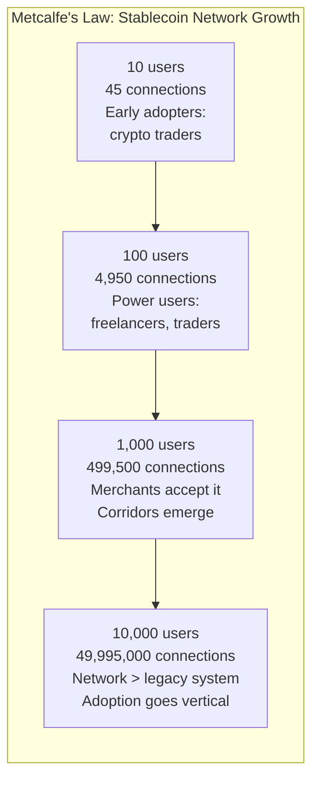
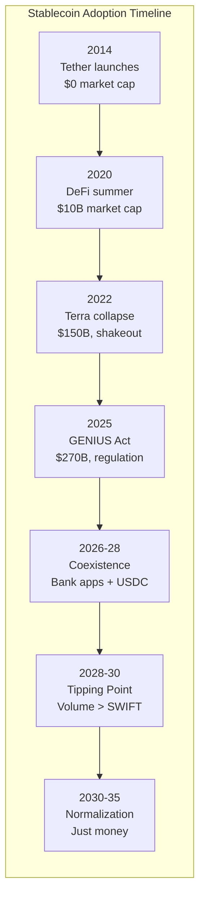

## The Messy Middle: What 2026-2035 Actually Looks Like

The previous chapters describe a broken present and a dream future. But you live in the transition. The uncomfortable, contradictory, half-built world between here and there.

### Where Our Characters Are Now

Before the timeline — a check on four people whose lives are already in this transition.

**Femi's business became programmable.** He started by sending USDT to his supplier in Shenzhen. Now he uses smart contract escrow — the payment releases automatically when the shipping container clears customs and the bill of lading is uploaded on-chain. On-chain proof of payment replaced the paper trail his accountant used to spend days assembling. His import business runs on code. But the question gnaws at him: by pricing everything in USDT and holding reserves in digital dollars, is he dollarizing Nigeria? Is every transaction that bypasses the naira a small erosion of his country's monetary sovereignty?[^1]

**Pablo's family now SAVES in stablecoins, not just receives them.** His mother in Caracas holds USDT for daily expenses but keeps a growing balance in USDC — the more regulated, more transparent alternative — as long-term savings. Pablo sends money weekly; his mother spends only what she needs and holds the rest. Venezuela is experiencing a quiet, private re-dollarization from the bottom up. His mother holds more digital dollars than the central bank wants her to.[^2]

**Mercy's success created a question she can't answer.** Her savings club in Harare preserved its value by converting to cUSD. Other clubs copied her method. Now dozens of groups across Harare are holding stablecoins instead of Zimbabwean dollars. The Central Bank of Zimbabwe is watching. What happens to monetary sovereignty when savings clubs — the grassroots backbone of community finance — abandon the local currency? Mercy didn't set out to undermine the monetary system. She set out to protect eleven women's savings. The systemic consequences are something she thinks about at night.[^3]

**Mika went from user to builder.** Her first experience — receiving USDC from a European design client into her Phantom wallet — was a revelation. "I was floored at how quickly it arrived." She didn't just adopt the technology. She turned the experience into Parallax, a stablecoin payroll platform. 93% wallet adoption among users.[^4] She's not just using the new architecture. She's building it. The IOU notebook her father kept is in a frame on her office wall.

---

### 2026-2028: The Coexistence Era

Your bank app offers "hold USDC" alongside your savings account. You're not sure what the difference is, and the bank is counting on that confusion to retain your deposits.

Venmo and CashApp run on stablecoin rails under the hood. You see "instant transfer." You don't know it's a blockchain. You don't need to.

Western Union's USDPT on Solana operates alongside its 500,000 physical locations. Old and new, side by side. MoneyGram lets you cash out USDC at convenience stores. The off-ramp IS the corner shop.

Some merchants accept USDC. Most don't. You still need a credit card for 90% of daily life.

DeFi yields attract informed savers — 4-8% versus 0.01% at banks. But your parents hear "blockchain" and think of the headlines: Terra, FTX, "crypto crash." The skepticism isn't irrational. It's informed by real losses. Building trust takes time.[^5]

Regulatory whiplash continues. One state's money transmitter license doesn't apply in the next state. Federal versus state tension on oversight. The crypto tax nightmare: every stablecoin swap technically generates a taxable event. Filing is brutal.

### 2028-2030: The Tipping Point

Network effects accelerate. This is Metcalfe's Law[^6] in action.

Metcalfe's Law states that the value of a network is proportional to the square of the number of its users. A phone network with 10 users has 45 possible connections. A network with 100 users has 4,950. A network with 1,000 users has 499,500. The value doesn't grow linearly — it grows exponentially.

Stablecoins are a textbook case. Every new wallet, every new merchant, every new on-ramp makes the network more valuable for everyone already in it. At some point, the network becomes more useful than the legacy system for a critical mass of users — and adoption goes vertical.

The "invisible adoption" moment: a major payroll provider processes salaries in stablecoins without employees knowing. Paychecks arrive faster. Nobody asks why.

The first Fortune 500 company offers stablecoin payroll as an option. Others follow within months. Amazon or Walmart accepts USDC at checkout. The signal: this is real money now.

The EU digital euro launches. It's slower and more restrictive than USDC. Adoption is tepid. Consumers who already use stablecoin-powered fintechs don't see the point.

China's e-CNY has a billion wallets but low voluntary usage. State push versus organic pull. Citizens use e-CNY because they're told to and USDT because they want to.

Stablecoin daily volume crosses SWIFT's $5-6 trillion per day. The old system is still running, but the new one is bigger.

### 2030-2035: The Normalization

"Stablecoin" becomes like "email" — a technical term nobody uses in daily life. It's just money. It's just how payments work.

Tokenized assets settle in stablecoins: stocks, bonds, real estate. 24/7 markets. Global access. $10 minimum investment. The concept of "market hours" becomes as quaint as banking hours already feel.

AI agents transact autonomously in stablecoins — a16z's projection of $30 trillion in autonomous transactions by 2030 starts materializing.[^7] Machine-to-machine commerce measured in billions of transactions per day. Your car, your home, your AI assistant — all have wallets.

The correspondent banking system is a relic. SWIFT is a standards body, not a payment rail. The six-hop $200 journey from Chapter 2 is a cautionary tale told in finance textbooks.

Some currencies have effectively dollarized via stablecoins — not officially, but functionally. Central banks adapt or lose relevance. The "free banking era 2.0" debate heats up: are we comfortable with Tether and Circle having this much monetary power?

The micropayment web is live. HTTP 402 activated. Browsers have native wallets. Pay-per-article journalism replaces ad clutter. Smart city infrastructure runs on stablecoin micropayments.

### What Goes Wrong During the Transition

A mid-tier stablecoin depegs during the transition. Smaller than Terra, but enough to scare retail users and trigger emergency regulation.

Regulatory fragmentation: some countries ban, others embrace. Users in banned countries go underground. The pattern from Nigeria — where banning crypto drove it to peer-to-peer markets and increased usage — repeats elsewhere.

The digital divide deepens before it narrows. Those without smartphones or reliable internet are left further behind as cash infrastructure contracts.

A major hack targets a DeFi protocol holding $2 billion+ in stablecoins. Congress holds emergency hearings. The industry responds with better security, but trust takes a hit.

Privacy versus surveillance battles intensify. Governments push for full transaction traceability. Privacy advocates push back with zero-knowledge tools. The tension doesn't resolve. It becomes a permanent feature of the landscape.

Tax and compliance infrastructure lags behind adoption. A gray period where most users are technically non-compliant because the tools to track and report stablecoin taxes don't work well yet.

---

By 2035, Pablo Toro won't remember the name of the app he used to send money home. Mercy Musodzi's savings club won't call it "the digital dollar" anymore — they'll just call it savings. Femi won't think of USDT as crypto. He'll think of it as how business works. And Mika Reyes won't need to explain Parallax to her father — because stablecoin payroll will be as unremarkable as direct deposit.

Every prediction here is grounded in something already happening. Some of it will be wrong. The timing might be off. The specific companies might be different. But the direction — the architectural shift from private ledgers to shared infrastructure — is underway, and it's not reversing.

What COULD reverse it? What could go catastrophically wrong? That's the next chapter.

---

[^1]: Character arc development for Femi. The dollarization question connects to the sovereignty analysis in Chapter 4C.

[^2]: Character arc development for Pablo. Venezuela's informal dollarization through stablecoins is documented in multiple sources including Reuters and Bloomberg.

[^3]: Character arc development for Mercy. The monetary sovereignty implications of grassroots stablecoin adoption connect to the IMF's concerns discussed in Chapter 4C.

[^4]: Character arc development for Mika. Parallax is a fictional company inspired by real stablecoin payroll platforms. The 93% wallet adoption figure is from the book's outline.

[^5]: Edelman Trust Barometer 2026: institutional trust remains below pre-2008 levels. In low-trust environments, adoption requires demonstrated results, not promises.

[^6]: Metcalfe's Law, attributed to Robert Metcalfe (inventor of Ethernet), states that the value of a telecommunications network is proportional to the square of the number of connected users (n²). While the exact mathematical relationship is debated, the core insight — that networks become exponentially more valuable as they grow — is well-established in network economics.

[^7]: a16z, projections on autonomous AI agent transactions, 2025.
