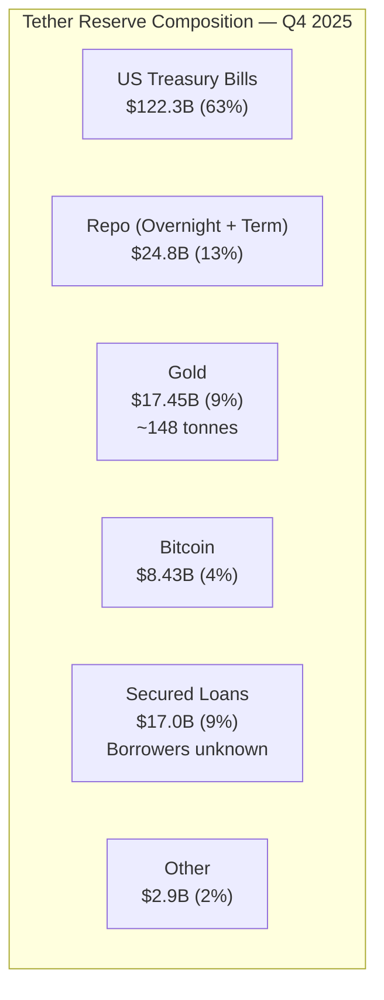

# A Stablecoin Dystopia

The trust shift from "I trust my bank" to "I trust this mechanism" is only valid if we're honest about what mechanisms have failed and can still fail.

## What's Already Broken

### The Collapse That Proved the Critics Right

May 2022. TerraUST — an algorithmic stablecoin[^1] backed not by dollars in a vault, but by a complex relationship with its sister token LUNA — lost its peg and entered a death spiral. In days, roughly $40 billion was vaporized: $18 billion in UST market cap and $22 billion in LUNA value.[^2]

The mechanism was supposed to be elegant: if UST dropped below $1, arbitrageurs would burn UST and mint LUNA, restoring the peg through supply reduction. But when confidence evaporated, the feedback loop reversed. More UST sold, more LUNA minted, LUNA crashed 99.99%, and the arbitrage couldn't keep up with the panic.

Anchor Protocol — a lending platform built on Terra — had attracted $18 billion in deposits by offering 20% APY[^3] on UST.[^4] Twenty percent annual return on what was marketed as a dollar. When new money stopped flowing in to sustain the yield, the system failed like a bank run meets a Ponzi scheme.

The contagion rippled outward. Three Arrows Capital became insolvent. Celsius froze customer withdrawals. The entire crypto credit market crumbled.

The human cost was staggering. A young trader in Colombia lost 100% of his life savings: "The guilt is unbearable. I've had big drawdowns before, but this time I'm zero, nothing."[^5] A disabled retiree living on $197 per month: "I'm not rich. So this hurts me." The Terra subreddit became a space of anguish — communities organized suicide prevention outreach for members expressing despair.

Janet Yellen, US Treasury Secretary, stated it plainly: "They present the same kind of risks we've known for centuries in connection with bank runs."[^6]

Money carries dreams and fears. When stablecoins fail, the emotional toll is devastating.

### The Catalog of Failures

Terra was the largest, but the pattern extends across multiple failure modes — in chronological order.

**USDT solvency scare (2018):** Tether dipped to $0.97 amid rumors that reserves didn't fully back outstanding tokens.[^7] The episode lasted days, not hours. It was the first public signal that the largest stablecoin's transparency was insufficient.

**MakerDAO Black Thursday (March 2020):** When COVID-19 panic crashed ETH by 70% in hours, MakerDAO's automated liquidation system broke down. Some vaults were liquidated for zero DAI due to network congestion — meaning liquidators acquired collateral for free. MakerDAO survived without a bailout, but the event exposed smart contract risk under extreme stress.[^8]

**Iron Finance / TITAN (June 2021):** A partial-collateral stablecoin — 75% USDC, 25% TITAN token.[^9] TITAN went from roughly $60 to $0 in a single day. Mark Cuban lost around $870,000 providing liquidity.[^10] A precursor warning to Terra that the community failed to heed.

**Cashio exploit (March 2022):** An infinite mint exploit on Solana. A coding error allowed an attacker to mint 2 billion CASH tokens without collateral and redeem approximately $52.8 million in real assets.[^11] The attacker called himself a "Robin Hood." The protocol was abandoned.

**Beanstalk governance attack (April 2022):** An attacker used a flash loan[^12] to temporarily accumulate 75% of governance votes,[^13] passed a proposal to drain roughly $182 million in collateral, and executed it in a single transaction. $77 million was laundered through Tornado Cash and never recovered. Bean crashed to $0.12.[^14] The lesson: even if the economic model is sound, operational security can zero you out.

**TerraUST collapse (May 2022):** Covered above. $40 billion vaporized.

**USDT depeg (May 2022):** Briefly hit roughly $0.95 during the Terra panic. Quickly recovered, but showed even the largest stablecoin is vulnerable to confidence shocks.[^15]

**USDC depeg (March 2023):** Circle disclosed $3.3 billion — 8% of reserves — was stuck at the collapsing Silicon Valley Bank. USDC fell to $0.87. $4.5 billion was redeemed in days — a modern digital bank run.[^16] It recovered when the FDIC backstopped SVB deposits. The lesson: even fully-backed stablecoins carry counterparty risk from the banking system they're supposed to replace.

**Cross-chain bridge hacks (2021-2023):** Roughly $2.5 billion stolen across multiple bridge exploits.[^?1] Wormhole lost $325 million — an attacker minted wrapped ETH on Solana without locking real ETH on Ethereum. Jump Trading replaced the funds. Nomad lost $190 million in a chaotic exploit where hundreds of copycat attackers drained the protocol.[^17] Bridges[^18] are the weakest link — high-value targets with small multisig security or poorly audited code.

The diversity of failure modes is itself a lesson. Terra was a bank run meets Ponzi. USDC was old-fashioned banking counterparty risk. Beanstalk and Cashio were code exploits. The only stablecoins that haven't broken their peg are fully fiat-backed — and even they've had moments of stress.

### Centralization and Censorship

Circle and Tether CAN and DO freeze wallet addresses. Over 800 combined, often at law enforcement request.[^19]

When Tornado Cash was sanctioned by the US Treasury, Circle blacklisted 81+ addresses and froze roughly $75,000 in USDC — demonstrating that your "self-custodied" digital dollars can be rendered worthless with one smart contract call.[^20]

Tether has frozen over 700 addresses. For users in sanctioned countries or using privacy tools, this is not a theoretical risk.

The philosophical tension is real: the promise of "money like cash" conflicts with the reality of centralized freeze capabilities. Rune Christensen, MakerDAO's founder: "We need a stablecoin that can survive blacklisting and censorship — truly decentralized."[^21] But truly decentralized stablecoins have historically been the ones that collapse. The tension doesn't resolve cleanly.

### The Tether Problem

Tether holds roughly $193 billion in total assets[^22] — the largest stablecoin by a wide margin. It's the quote currency on most non-US exchanges, the collateral for billions in DeFi loans, and the primary dollar instrument for hundreds of millions of users in Asia, Africa, and Latin America. "Too big to fail" for crypto markets, but with no one to bail it out.

The reserve composition as of Q4 2025: $122.3 billion in US Treasury bills, plus $19.3 billion in overnight repo and $5.5 billion in term repo — roughly $147 billion in Treasury exposure.[^23] $17.45 billion in gold — quietly making Tether one of the world's largest gold holders at approximately 148 tonnes.[^24] $8.43 billion in Bitcoin. And $17 billion in secured loans with undisclosed borrowers, up from $5 billion.[^25] The borrowers and collateral are unknown.

No full audit. Only quarterly attestations from BDO Italia. Tether's own report acknowledges: "Our figures are a one-day attestation, not an audit."[^26] No Big-4 accounting firm has audited Tether. This keeps many institutions away.

Under DOJ investigation for potential bank fraud — no charges filed.[^27] Previous settlements: $42.5 million CFTC fine for misleading reserve claims, $18.5 million NYAG settlement, barred from operating in New York.[^28] At one point in 2017, Tether was found to have had "virtually no reserves."

On the other hand: Tether's CEO Paolo Ardoino argues USDT is "the dollar for the last mile, for the unbanked." Almost the entire user base is in emerging markets.[^29] He frames Tether as "advancing US dollar hegemony across emerging markets."

The stress test it passed: after FTX collapsed, Tether honored over $7 billion in redemptions within 48 hours without breaking the peg.[^30] It froze roughly $835 million in USDT related to crime.

The stress test it hasn't faced: what happens at scale. If Tether's reserves were found to be significantly short, or if a regulatory action froze its banking relationships, the forced liquidation of $141 billion in Treasury bills could spill into traditional markets. The FSB has warned about exactly this scenario.[^31]

## CBDCs: The Government Alternative

If stablecoins are private digital dollars, CBDCs[^32] are the government's answer: digital currency issued directly by a central bank. Over 130 countries are exploring them. Three major ones have launched. The results are instructive.

**China's e-CNY** is the most advanced. 180 million wallet accounts. Roughly 7.3 trillion yuan (~$1.0 trillion) in cumulative transactions by mid-2025.[^33] The government pushed adoption through salary payments, transit systems, and merchant incentives.

The result: "almost absent from daily life," according to multiple reports.[^34] Chinese citizens use e-CNY when required and switch back to Alipay and WeChat Pay — which are faster, more integrated, and have better user experience — the moment they can. And they use USDT underground when they want dollars.

The privacy model tells the story: "anonymity for small-value, traceability for high-value."[^35] Or more plainly: the government sees everything above a threshold. Agustín Carstens, head of the BIS, stated the quiet part in October 2020: "The central bank will have absolute control on the rules and regulations that determine the use of that expression of central bank liability. And also, we will have the technology to enforce that."[^36]

**Nigeria's eNaira** launched in October 2021. The IMF's verdict: it "has not moved beyond initial wave of limited adoption."[^37] Fewer than 1 million active users in a country of 220 million. Meanwhile, Nigeria simultaneously generated $59 billion in crypto volume — overwhelmingly in USDT.[^38] The market voted. It didn't vote for the government option.

**The Bahamas' Sand Dollar** has been in circulation for years. Total value in circulation: approximately $2.1 million.[^39] That's not a typo.

The digital euro is in a "preparation phase." The digital pound is in "consultation."[^40]

The pattern across every country with both a CBDC and stablecoin access: stablecoins win on adoption. CBDCs offer what governments want — monetary control, transaction visibility, programmable policy tools. Stablecoins offer what users want — dollar access, privacy, cross-border portability, 24/7 availability without government infrastructure.

The IMF has proposed a "synthetic CBDC" concept — regulated private issuers with a public backstop[^41] — which looks remarkably like well-regulated stablecoins. The future may not be CBDC versus stablecoin. It may be convergence.

The key insight: stablecoins split "hold dollars" from "an institution grants you permission to hold dollars." That unbundling is the revolution. CBDCs keep the bundle intact. Users, given the choice, are choosing the unbundled version.

```mermaid
flowchart TB
    subgraph CBDC["CBDCs"]
        direction TB
        CB1["Issued by: Central bank"]
        CB2["Control: Full government oversight"]
        CB3["Privacy: Government sees all transactions"]
        CB4["Access: Requires government infrastructure"]
        CB5["Cross-border: Limited by design"]
        CB6["Adoption: Mandated, low organic uptake"]
    end

    subgraph Stable["Stablecoins"]
        direction TB
        S1["Issued by: Private companies"]
        S2["Control: Protocol rules + market forces"]
        S3["Privacy: Pseudonymous, zkKYC emerging"]
        S4["Access: Permissionless, any smartphone"]
        S5["Cross-border: Native, instant"]
        S6["Adoption: Organic, high demand-driven"]
    end
```

## Illicit Use: The Uncomfortable Truth

Approximately 10% of stablecoin volume has been linked to illicit activity — sanctions evasion, money laundering, fraud.[^?2]

In October 2025, the EU sanctioned a Russian state-backed stablecoin called A7A5 — the first stablecoin sanctioned for geopolitical reasons. The EU Council stated: "The stablecoin A7A5, created with Russian state support, has emerged as a prominent tool for financing Russia's war in Ukraine."[^42] Russia legalized crypto for foreign trade settlement in 2024, explicitly as a sanctions evasion mechanism.[^43]

Iran has explored similar channels. Nigerian informal economy participants use USDT to circumvent capital controls — some legitimately, some not. The line between "capital controls evasion" and "economic survival" is drawn differently depending on which side of the controls you're on.

Chimezie Chuta, founder of the Blockchain Nigeria User Group, described the dynamic after Nigeria's 2021 crypto ban: "The ban drove crypto underground but didn't stop it. Nigerians are simply too hungry for dollars and yield."[^44]

The counter-argument is straightforward: cash has the same problem, but worse. The UN estimates $800 billion to $2 trillion in cash is laundered annually — dwarfing blockchain illicit flows.[^45] And blockchain transactions are MORE traceable than cash, not less. Every stablecoin transaction is permanently recorded on a public ledger. Chainalysis, Elliptic, and other analytics firms can trace flows with a precision impossible for physical currency.

Stablecoins create a new channel for illicit finance AND a more traceable one. The question is whether enforcement keeps pace with the new channel's scale. So far, it mostly has — Tether has frozen $835 million in crime-linked USDT, and blockchain analytics contributed to multiple major law enforcement operations.[^46] But the tools need to scale with adoption.

---

[^1]: An algorithmic stablecoin attempts to maintain its peg through code-based supply adjustments rather than holding dollar reserves in a bank. When the token drops below $1, the algorithm reduces supply; when it rises above $1, it increases supply. TerraUST was the largest algorithmic stablecoin before its collapse.

[^2]: CoinDesk, Bloomberg, multiple sources, May 2022. Combined UST and LUNA value destruction.

[^3]: APY (Annual Percentage Yield) is the annualized rate of return on a deposit, accounting for compounding.

[^4]: Anchor Protocol, Terra blockchain, peak deposits prior to May 2022.

[^5]: Terra collapse victim in Colombia, quoted in Vice, May 2022.

[^6]: Janet Yellen, US Treasury Secretary, Senate testimony on stablecoins and financial stability, 2022-2023.

[^7]: USDT traded at $0.97 on multiple exchanges in October 2018 amid solvency concerns.

[^8]: MakerDAO, "Black Thursday" post-mortem, March 2020. ETH price crashed from ~$200 to ~$86.

[^9]: Iron Finance used a partial-collateralization model where the stablecoin IRON was backed partly by USDC (a stable asset) and partly by TITAN (a volatile governance token).

[^10]: Mark Cuban disclosed his Iron Finance losses publicly via Twitter/X, June 2021.

[^11]: Cashio exploit, Solana blockchain, March 2022. Approximately $52.8 million drained.

[^12]: A flash loan is a loan that is borrowed and repaid within a single blockchain transaction — typically lasting seconds. Because no collateral is required (the loan is atomic — it either completes fully or reverts), flash loans can be used to temporarily control enormous sums for governance attacks or arbitrage.

[^13]: A governance token grants holders voting rights over a protocol's parameters and treasury. In Beanstalk's case, accumulating 75% of governance votes allowed the attacker to pass a proposal draining the protocol's funds.

[^14]: Beanstalk exploit, April 2022. $182 million in collateral drained, $77 million laundered through Tornado Cash.

[^15]: USDT briefly traded at approximately $0.95 on major exchanges during the May 2022 Terra panic.

[^16]: Circle disclosed Silicon Valley Bank exposure on March 10, 2023. USDC traded as low as $0.87.

[^17]: Wormhole exploit: February 2022, $325 million. Nomad exploit: August 2022, $190 million.

[^18]: A bridge (cross-chain bridge) is infrastructure that allows tokens to move between different blockchains — for example, moving USDC from Ethereum to Solana. Bridges are high-value targets because they hold large pools of locked assets.

[^19]: Combined frozen address data from Circle and Tether transparency reports, as of Q4 2025.

[^20]: Tornado Cash sanctioned by US Treasury OFAC, August 2022. Circle subsequently blacklisted associated addresses.

[^21]: Rune Christensen, MakerDAO founder, CoinDesk, 2024.

[^22]: Tether, "Q4 2025 Financial Figures Report." Total assets: $192,878 million.

[^23]: Tether, Q4 2025 report. US T-bills: $122.3B; overnight repo: $19.3B; term repo: $5.5B.

[^24]: Tether, Q4 2025 report. Gold holdings: $17.45B (~148 tonnes), placing Tether among the top ~30 gold holders globally.

[^25]: Tether, Q4 2025 report. Secured loans: $17.04B, up from approximately $5B in prior years.

[^26]: Tether attestation methodology disclosure. Attestations performed by BDO Italia (previously Moore Cayman).

[^27]: Wall Street Journal, October 2024. DOJ investigation into potential bank fraud; no charges filed as of early 2026.

[^28]: CFTC settlement: $42.5 million, October 2021. NYAG settlement: $18.5 million, February 2021.

[^29]: Paolo Ardoino, Tether CEO, Reuters, April 2024.

[^30]: Tether redemption data following FTX collapse, November 2022.

[^31]: Financial Stability Board (FSB), reports on stablecoin systemic risk, 2023-2025.

[^32]: A CBDC (Central Bank Digital Currency) is a digital form of a country's fiat currency, issued and backed directly by the central bank. Unlike stablecoins (issued by private companies), CBDCs carry the full faith and credit of the issuing government.

[^33]: People's Bank of China, e-CNY statistics, mid-2025.

[^34]: Multiple reports including Reuters and South China Morning Post, 2024-2025, describing low voluntary e-CNY usage despite government promotion.

[^35]: People's Bank of China, e-CNY design whitepaper. The "managed anonymity" model provides privacy for small transactions and traceability for large ones.

[^36]: Agustín Carstens, BIS General Manager, speech at the IMF cross-border payments conference, October 2020.

[^37]: IMF, Nigeria Article IV Consultation, 2023.

[^38]: Chainalysis, "Geography of Cryptocurrency Report," 2024. Nigeria crypto volume.

[^39]: Central Bank of The Bahamas, Sand Dollar statistics, 2024-2025.

[^40]: European Central Bank, "Preparation phase for a digital euro," 2024. Bank of England, "Digital pound: consultation," 2023.

[^41]: IMF, "The Rise of Digital Money," Tobias Adrian and Tommaso Mancini-Griffoli, 2019. The "synthetic CBDC" concept.

[^42]: EU Council, October 2025. Sanctions designation of A7A5 stablecoin.

[^43]: Russian Federation, legislation legalizing crypto for foreign trade settlement, 2024.

[^44]: Chimezie Chuta, founder of Blockchain Nigeria User Group, quoted in Nigerian tech press, 2022-2023.

[^45]: United Nations Office on Drugs and Crime (UNODC), estimates of global money laundering, 2-5% of global GDP annually.

[^46]: Tether frozen USDT data; Chainalysis / Elliptic law enforcement collaboration reports.

[^?1]: [NEEDS VERIFICATION] The $2.5 billion aggregate bridge hack figure is commonly cited. Major incidents: Wormhole $325M (Feb 2022), Nomad $190M (Aug 2022), Poly Network $611M (Aug 2021, mostly returned), Ronin/Axie $625M (March 2022). Verify aggregate and whether Ronin should be included as a "bridge" hack.

[^?2]: [NEEDS VERIFICATION] The ~10% illicit activity figure for stablecoin-linked transactions. Chainalysis 2024 Crypto Crime Report may have more precise figures. Cash illicit percentage comparisons also need verification.
